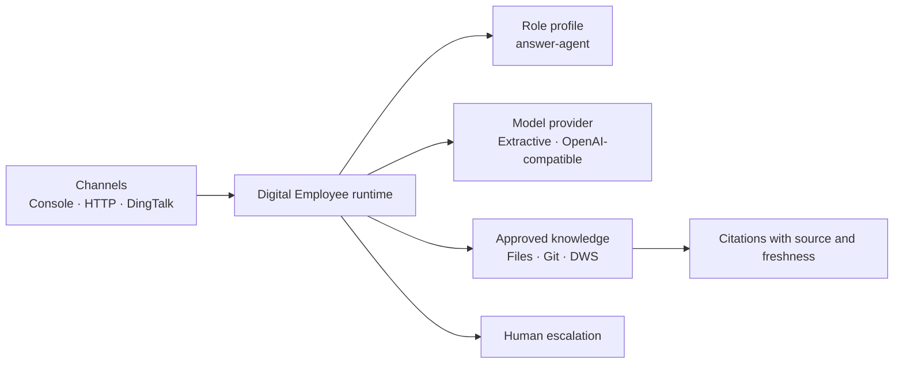

# Digital Employee

[简体中文](README.zh-CN.md)

An open, self-hosted runtime for building role-based digital employees from
approved knowledge sources and tools.

The first shipped profile is `answer-agent`: a read-only team support employee
that answers with citations, refuses unsupported claims, and escalates
uncertainty to a human.

## Install a release

The same `0.1.0` release is distributed through three public channels:

| Channel | Command or download |
| --- | --- |
| npm | `npm install --global @fullstack-ai-infra/digital-employee@0.1.0` |
| GHCR | `docker pull ghcr.io/fullstack-ai-infra/digital-employee:0.1.0` |
| GitHub Release | Download the package and checksum from [Releases](https://github.com/fullstack-ai-infra/digital-employee/releases) |

After an npm install, run the zero-credential demo from any directory:

```bash
digital-employee ask --question "What should I include in an incident report?"
```

Or start the HTTP demo from the container:

```bash
docker run --rm -p 3000:3000 \
  ghcr.io/fullstack-ai-infra/digital-employee:0.1.0
```

## Why a runtime, not one bot

`answer-agent` is a role profile, not the whole product. A profile defines an
employee's instructions, approved sources, available tools, permissions, and
human escalation policy. The same runtime can later host other roles without
forking its channel, memory, policy, or observability code.



## Five-minute local demo

Node.js 20 or newer is required. The demo uses only local public fixtures and
does not need a model key, DingTalk app, or DWS login.

```bash
git clone https://github.com/fullstack-ai-infra/digital-employee.git
cd digital-employee
npm install
npm run demo -- --question "What should I include in an incident report?"
```

Expected behavior:

```text
Based on the approved source “Example team handbook”:

## Incident reports
Include the application version, sanitized command, complete error category,
and the time window...

Sources:
- Example team handbook: source://demo-handbook/handbook.md
```

Try an unsupported action:

```bash
npm run demo -- --question "Approve a production deployment for me."
```

The read-only profile does not pretend to act:

```text
I could not find enough approved evidence. Please ask a maintainer.

Human review: human-support (model_requested)
```

## Entry points

### One question

```bash
npm run ask -- \
  --config ./configs/demo.json \
  --question "What belongs in an incident report?"
```

### Interactive console

```bash
npm start -- --config ./configs/demo.json
```

### HTTP

The server listens on loopback by default:

```bash
npm run serve -- --config ./configs/demo.json --port 3000
curl -sS http://127.0.0.1:3000/v1/ask \
  -H 'content-type: application/json' \
  -d '{"message":"What belongs in an incident report?"}'
```

Set `server.apiTokenEnv` in the config before exposing the HTTP entry point
beyond a local development machine. The built-in HTTP endpoint is deliberately
stateless: it rejects caller-selected request, actor, and session identifiers,
so one bearer-token holder cannot attach to another caller's history. Put a
gateway with per-user authentication in front of the core before adding
persistent HTTP conversations.

### DingTalk Stream

```bash
cp configs/dingtalk-dws.example.json configs/local.json
export DINGTALK_CLIENT_ID='...'
export DINGTALK_CLIENT_SECRET='...'
export OPENAI_API_KEY='...'
npm start -- --config ./configs/local.json --channel dingtalk
```

The DingTalk adapter hashes actor and conversation identifiers before passing
them to the runtime. Default logs omit message bodies, user identifiers, and
session webhooks.

## Knowledge sources

| Source | Status | Boundary |
| --- | --- | --- |
| Filesystem | Shipped | Explicit root, extension and size limits; skips symlinks and sensitive filenames |
| Git | Shipped | Credential-free HTTPS repository; isolated cache; no shell |
| DWS | Shipped, optional | Explicit profile and approved read-only queries only |

The [DWS connector](docs/connectors/dws.md) can turn approved DingTalk
documents, AI Minutes, group messages, Wiki nodes, and Drive metadata into
retrievable documents. It never discovers a profile, scans an account, or
auto-paginates. DWS remains the authorization and audit boundary.

Install and learn more in the
[DingTalk Workspace CLI repository](https://github.com/DingTalk-Real-AI/dingtalk-workspace-cli).

## Model providers

- `extractive`: zero-credential provider for a deterministic local demo. It
  quotes the best matching approved section and escalates no-match questions.
- `openai-compatible`: works with compatible `/chat/completions` endpoints.
  The key is read from an environment variable. Private-network endpoints,
  such as a local Ollama or vLLM deployment, require an explicit
  `allowPrivateNetwork` opt-in.

## Safety defaults

- `answer-agent` is read-only.
- No source discovery or account-wide ingestion.
- DWS commands and flags are allowlisted and always use machine-readable JSON.
- `answer-agent` escalates answers that do not resolve to an approved citation.
- Model and webhook requests have time and response-size limits.
- OpenAI-compatible endpoints reject literal and DNS-resolved private
  addresses unless `allowPrivateNetwork` is explicitly enabled.
- DingTalk session webhooks accept exact official HTTPS hosts only.
- Session memory has TTL and capacity limits.
- FAQ memory is fail-closed: it learns only from answered exchanges after an
  injected trusted reviewer authorizes explicitly verified feedback.
- Structured errors redact credential-like fields and never expose stacks.

Read [SECURITY.md](SECURITY.md) and
[docs/architecture.md](docs/architecture.md) before adding tools or private
sources. The [verification ledger](docs/verification.md) separates automated,
container, live DWS, and not-yet-live-tested evidence.

## What is shipped

| Capability | State |
| --- | --- |
| Generic channel/source/model/profile contracts | Shipped |
| Read-only `answer-agent` profile | Shipped |
| Console and HTTP entry points | Shipped |
| DingTalk Stream channel | Shipped; live credentials required for integration verification |
| Filesystem, Git, and DWS sources | Shipped |
| Human escalation and authorized verified FAQ feedback | Shipped |
| Project-assistant and operations profiles | Planned |
| Write tools and approval workflow | Planned; disabled in the first release |
| Hosted multi-tenant service | Not a goal for `0.1` |

## Relationship to `mem`

Digital Employee owns channels, role policy, answer orchestration, citations,
feedback, and human escalation. The
[`mem`](https://github.com/fullstack-ai-infra/mem) project can become an
optional durable memory/retrieval backend; this repository does not duplicate
that memory plane.

## Development

```bash
npm ci
npm run typecheck
npm run build
npm run check
npm audit --omit=dev --audit-level=high
```

TypeScript is the source of truth for applications, runtime packages,
connectors, profiles, and tests. `npm run build` creates executable ESM,
declarations, source maps, and public demo assets under `dist/`; published
package exports and the CLI use only that compiled output. The JavaScript
files under `scripts/` are build, security, and release automation and are not
part of the runtime import graph.

See [CONTRIBUTING.md](CONTRIBUTING.md). Licensed under
[Apache-2.0](LICENSE).
