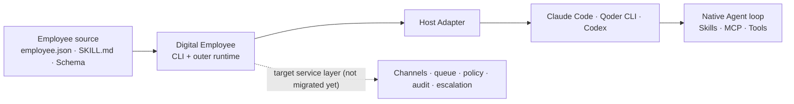
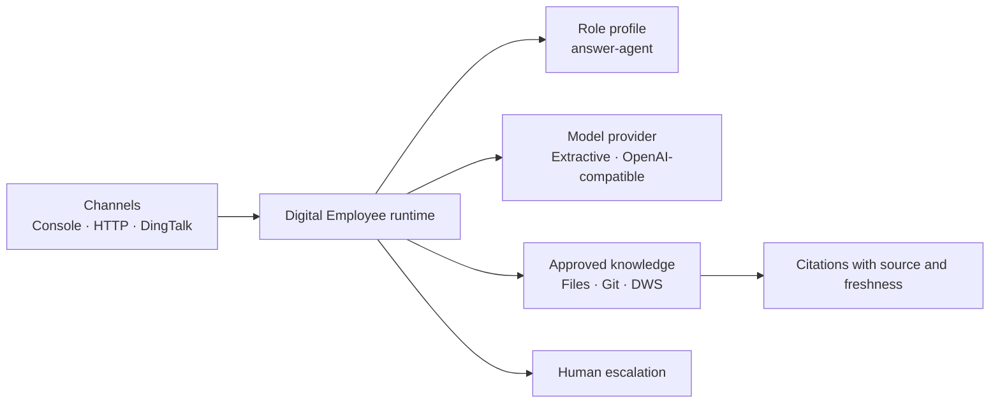

# Digital Employee: Agent-native employee CLI and outer runtime

[简体中文](README.zh-CN.md)

Digital Employee is being built as an open CLI, package contract and outer
service boundary for portable digital employees. Claude Code, Qoder CLI, Codex
or another capable Agent host owns the model, context and native tool loop. The
target outer layer owns host adapters, policy, channels, queues, audit and
human escalation.

The current source delivers the CLI, portable employee package, model-free
preflight and a one-shot Qoder adapter. The Agent-native long-running service
layer (`service start`) is not shipped yet.

The first recipe is `answer-agent`: a read-only team support employee that
answers with citations, refuses unsupported claims, and escalates uncertainty
to a human. The original `0.1` answer runtime remains available as the
`standalone-v1` compatibility path.



## Source-tree workflow

The current source provides package scaffolding, static validation and local
host diagnosis. None of these commands starts a model run:

```bash
npm ci
npm run build
node ./dist/apps/cli/bin.js doctor
node ./dist/apps/cli/bin.js init ../team-answer --author your-team
node ./dist/apps/cli/bin.js validate ../team-answer
node ./dist/apps/cli/bin.js doctor --engine qoder
```

See the [portable employee package](docs/employee-package.md) and the
[Agent-host boundary ADR](docs/decisions/0001-agent-host-boundary.md). The
[Agent Host support policy](docs/agent-hosts.md) records the exact status:
Qoder is the only runnable source adapter; Claude Code, Codex, Qwen Code and
CodeBuddy Code are probe-only (the latter two are also adapter candidates).

The first runnable adapter is a stateless, read-only Qoder CLI 1.1.x path. A
service token stays in the deployment environment, never in the employee
package. Unlike the commands above, `run` starts a real Agent/model run and may
consume Qoder credits:

```bash
export QODER_PERSONAL_ACCESS_TOKEN='...'
node ./dist/apps/cli/bin.js validate ../team-answer --engine qoder
printf '%s\n' '{"message":"What does the approved handbook say?"}' | \
  node ./dist/apps/cli/bin.js run ../team-answer --engine qoder --stdin
```

`--stdin`/`--input-file` keep task, Skill and Schema data in Qoder's stdin JSONL
protocol rather than child-process arguments. This Qoder path is still a
one-shot local/single-tenant technical preview, not a marketplace-ready online
employee service. Claude Code and Codex remain probe-only. Qoder MCP,
attachments, session resume, write tools and approval callbacks are also
deliberately rejected in this first adapter.

## Release status

The Agent-native commands above are a source preview for the next minor
release, expected to be `0.2.0`; they are **not** present in the published
`0.1.0` artifacts. Use a source checkout for `init`, `validate`, `doctor` and
`run` until that release is published. Do not retag or overwrite `0.1.0`.

The frozen `0.1.0` compatibility release is distributed through three public
channels:

| Channel | Command or download |
| --- | --- |
| npm | `npm install --global @fullstack-ai-infra/digital-employee@0.1.0` |
| GHCR | `docker pull ghcr.io/fullstack-ai-infra/digital-employee:0.1.0` |
| GitHub Release | Download the package and checksum from [Releases](https://github.com/fullstack-ai-infra/digital-employee/releases) |

That release contains only the historical answer runtime. Its container starts
the old HTTP demo and does not contain Qoder or the new package commands:

```bash
docker run --rm -p 3000:3000 \
  ghcr.io/fullstack-ai-infra/digital-employee:0.1.0
```

The current source `Dockerfile` is instead a generic CLI base image and defaults
to help. Enter `legacy` explicitly only when testing the compatibility runtime:

```bash
docker build -t digital-employee:source .
docker run --rm digital-employee:source
docker run --rm -p 3000:3000 digital-employee:source \
  legacy serve --config ./dist/configs/demo.json --host 0.0.0.0 --port 3000
```

## Not one bot and not another Agent loop

`answer-agent` is a recipe, not the whole product. An Agent-native employee
package uses `employee-package.v1alpha1`, with `SKILL.md` as the role/workflow
source, JSON Schema as its public task contract, and MCP for external
capabilities. Host-specific instructions and arguments are generated
projections rather than the source of truth.

The strict `employee-profile.v1` manifest remains part of `standalone-v1`. The CLI
assembles profiles, sources, models, channels, and tools through an explicit
registry, so a locally approved role module can be added without changing core
switch logic. Local modules are disabled by default, require an exact caller
allowlist, and cannot be remote URLs, path traversals, or symlinks. See the
[profile manifest and compatibility contract](docs/profile-manifest.md).



## Five-minute `standalone-v1` demo

Node.js 20 or newer is required. The demo uses only local public fixtures and
does not need a model key, DingTalk app, or DWS login.

```bash
git clone https://github.com/fullstack-ai-infra/digital-employee.git
cd digital-employee
npm install
npm run legacy:demo -- --question "What should I include in an incident report?"
```

Expected behavior:

```text
Based on the approved source “Example team handbook”:

## Incident reports
Include the application version, sanitized command, complete error category,
and the time window...

Sources:
- Example team handbook: source://demo-handbook/handbook.md
```

Try an unsupported action:

```bash
npm run legacy:demo -- --question "Approve a production deployment for me."
```

The read-only profile does not pretend to act:

```text
I could not find enough approved evidence. Please ask a maintainer.

Human review: human-support (model_requested)
```

## `standalone-v1` entry points

The authoritative namespace is `digital-employee legacy ...` / `npm run
legacy:*`. Top-level `ask`, `sync`, `start` and `serve` remain deprecated
aliases through `0.x`. Agent-native `run` never falls back here when a host
fails.

### One question

```bash
npm run legacy:ask -- \
  --config ./configs/demo.json \
  --question "What belongs in an incident report?"
```

### Interactive console

```bash
npm run legacy:start -- --config ./configs/demo.json
```

### HTTP

The server listens on loopback by default:

```bash
npm run legacy:serve -- --config ./configs/demo.json --port 3000
curl -sS http://127.0.0.1:3000/v1/ask \
  -H 'content-type: application/json' \
  -d '{"message":"What belongs in an incident report?"}'
```

Set `server.apiTokenEnv` in the config before exposing the HTTP entry point
beyond a local development machine. The built-in HTTP endpoint is deliberately
stateless: it rejects caller-selected request, actor, and session identifiers,
so one bearer-token holder cannot attach to another caller's history. Put a
gateway with per-user authentication in front of the core before adding
persistent HTTP conversations.

### DingTalk Stream

```bash
cp configs/dingtalk-dws.example.json configs/local.json
export DINGTALK_CLIENT_ID='...'
export DINGTALK_CLIENT_SECRET='...'
export OPENAI_API_KEY='...'
npm run legacy:start -- --config ./configs/local.json --channel dingtalk
```

The DingTalk adapter hashes actor and conversation identifiers before passing
them to the runtime. Default logs omit message bodies, user identifiers, and
session webhooks.

## Knowledge sources

| Source | Status | Boundary |
| --- | --- | --- |
| Filesystem | Shipped | Explicit root, extension and size limits; skips symlinks and sensitive filenames |
| Git | Shipped | Credential-free HTTPS repository; isolated cache; no shell |
| DWS | Shipped, optional | Explicit profile and approved read-only queries only |

The [DWS connector](docs/connectors/dws.md) can turn approved DingTalk
documents, AI Minutes, group messages, Wiki nodes, and Drive metadata into
retrievable documents. It never discovers a profile, scans an account, or
auto-paginates. DWS remains the authorization and audit boundary.

Install and learn more in the
[DingTalk Workspace CLI repository](https://github.com/DingTalk-Real-AI/dingtalk-workspace-cli).

## Model providers

- `extractive`: zero-credential provider for a deterministic local demo. It
  quotes the best matching approved section and escalates no-match questions.
- `openai-compatible`: works with compatible `/chat/completions` endpoints.
  The key is read from an environment variable. Private-network endpoints,
  such as a local Ollama or vLLM deployment, require an explicit
  `allowPrivateNetwork` opt-in.

## Safety defaults

- `answer-agent` is read-only.
- No source discovery or account-wide ingestion.
- DWS commands and flags are allowlisted and always use machine-readable JSON.
- `answer-agent` escalates answers that do not resolve to an approved citation.
- Model and webhook requests have time and response-size limits.
- OpenAI-compatible endpoints reject literal and DNS-resolved private
  addresses unless `allowPrivateNetwork` is explicitly enabled.
- DingTalk session webhooks accept exact official HTTPS hosts only.
- Session memory has TTL and capacity limits.
- FAQ memory is fail-closed: it learns only from answered exchanges after an
  injected trusted reviewer authorizes explicitly verified feedback.
- Structured errors redact credential-like fields and never expose stacks.

Read [SECURITY.md](SECURITY.md) and
[docs/architecture.md](docs/architecture.md) before adding tools or private
sources. The [verification ledger](docs/verification.md) separates automated,
container, live DWS, and not-yet-live-tested evidence.

## What is shipped

| Capability | State |
| --- | --- |
| `employee-package.v1alpha1`, `agent-host.v1`, capability negotiation | Shipped in source |
| `init`, static `validate`, local `doctor` | Shipped in source |
| Qoder CLI 1.1.x read-only, stateless `run --engine qoder` adapter | Shipped in source; live model entitlement not tested |
| Claude Code and Codex run adapters | Probe-only; planned |
| Agent-native `service start` with channels, queue and audit | Not shipped; next phase |
| `standalone-v1` profile and channel/source/model/tool registry | Shipped; compatibility path |
| Read-only `answer-agent` profile | Shipped |
| Console and HTTP entry points | Shipped |
| DingTalk Stream channel | Shipped; live credentials required for integration verification |
| Filesystem, Git, and DWS sources | Shipped |
| Human escalation and authorized verified FAQ feedback | Shipped |
| Project-assistant and operations profiles | Planned |
| Write tools and approval workflow | Planned; disabled in the first release |
| Marketplace, pricing and hosted multi-tenant service | Separate future platform; not part of `0.1` |

## Relationship to `mem`

Digital Employee owns channels, role policy, answer orchestration, citations,
feedback, and human escalation. The
[`mem`](https://github.com/fullstack-ai-infra/mem) project can become an
optional durable memory/retrieval backend; this repository does not duplicate
that memory plane.

## Development

```bash
npm ci
npm run typecheck
npm run build
npm run check
npm audit --omit=dev --audit-level=high
```

TypeScript is the source of truth for applications, runtime packages,
connectors, profiles, and tests. `npm run build` creates executable ESM,
declarations, source maps, and public demo assets under `dist/`; published
package exports and the CLI use only that compiled output. The JavaScript
files under `scripts/` are build, security, and release automation and are not
part of the runtime import graph.

See [CONTRIBUTING.md](CONTRIBUTING.md). Licensed under
[Apache-2.0](LICENSE).
