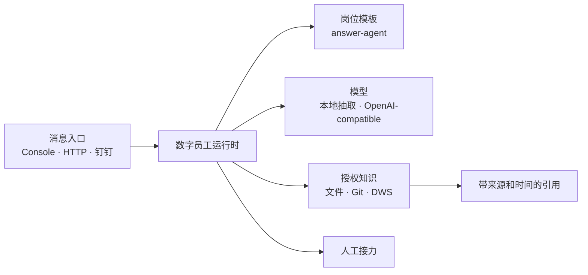

# Digital Employee：可复用的数字员工运行时

[English](README.md)

Digital Employee 是一个开源、自托管的数字员工运行时。它把岗位身份、知识源、工具权限、消息入口和人工接力做成可配置能力。

首个已经交付的岗位是 `answer-agent`：一个默认只读、答案带出处、证据不足就转人工的团队答疑员工。

## 安装正式版本

同一个 `0.1.0` 版本通过三个公开渠道分发：

| 渠道 | 安装或下载方式 |
| --- | --- |
| npm | `npm install --global @fullstack-ai-infra/digital-employee@0.1.0` |
| GHCR | `docker pull ghcr.io/fullstack-ai-infra/digital-employee:0.1.0` |
| GitHub Release | 从 [Releases](https://github.com/fullstack-ai-infra/digital-employee/releases) 下载软件包和校验文件 |

npm 安装后，可以在任意目录运行无需凭证的演示：

```bash
digital-employee ask --question "What should I include in an incident report?"
```

也可以直接通过容器启动 HTTP 演示：

```bash
docker run --rm -p 3000:3000 \
  ghcr.io/fullstack-ai-infra/digital-employee:0.1.0
```

## 不是只开源一个机器人

`answer-agent` 是岗位模板，不是整个产品。岗位模板负责定义：

- 它是谁、服务什么领域；
- 可以读取哪些知识；
- 可以使用哪些工具；
- 哪些操作只读，哪些操作必须审批；
- 没把握时交给谁。

同一个运行时后续可以承载项目助理、运营员工等岗位，而不需要复制消息、记忆、权限和审计代码。



## 五分钟本地跑通

需要 Node.js 20 或更高版本。默认演示只读取仓库里的公开示例资料，不需要模型密钥、钉钉应用或 DWS 登录。

```bash
git clone https://github.com/fullstack-ai-infra/digital-employee.git
cd digital-employee
npm install
npm run demo -- --question "What should I include in an incident report?"
```

它会从批准的示例手册中提取相关段落，并附带来源：

```text
Based on the approved source “Example team handbook”:

## Incident reports
Include the application version, sanitized command, complete error category,
and the time window...

Sources:
- Example team handbook: source://demo-handbook/handbook.md
```

再问一个需要实际执行的请求：

```bash
npm run demo -- --question "Approve a production deployment for me."
```

只读岗位不会假装已经操作：

```text
I could not find enough approved evidence. Please ask a maintainer.

Human review: human-support (model_requested)
```

## 四种入口

单次问答：

```bash
npm run ask -- --config ./configs/demo.json --question "..."
```

交互式命令行：

```bash
npm start -- --config ./configs/demo.json
```

本地 HTTP：

```bash
npm run serve -- --config ./configs/demo.json --port 3000
```

内置 HTTP 入口默认无状态，并拒绝客户端自选 `requestId`、`actorId` 和 `sessionId`，避免共享 Bearer Token 的调用方串到其他人的会话历史。需要多轮 HTTP 会话时，应先在核心前增加按用户认证的网关。

钉钉 Stream：

```bash
cp configs/dingtalk-dws.example.json configs/local.json
export DINGTALK_CLIENT_ID='...'
export DINGTALK_CLIENT_SECRET='...'
export OPENAI_API_KEY='...'
npm start -- --config ./configs/local.json --channel dingtalk
```

钉钉适配器会先把用户与会话标识哈希化，再交给通用运行时。默认日志不输出问题正文、用户 ID 和会话 Webhook。

## DWS：数字员工连接钉钉工作空间的能力层

答疑岗位把 DWS 当作“眼睛”，读取经过批准的：

- 钉钉文档；
- AI 听记摘要与转写；
- 指定群、指定时间范围内的聊天记录；
- Wiki 空间和节点；
- 钉盘文件元数据。

DWS 连接器要求显式 `profile` 和逐条 `approvedQueries`。它不会自动选择账号、扫描整个组织、自动翻页或跟随搜索结果读取更多对象。详细边界见 [DWS 连接器文档](docs/connectors/dws.md)。

DWS 的安装、授权和完整能力请查看
[DingTalk Workspace CLI 开源仓库](https://github.com/DingTalk-Real-AI/dingtalk-workspace-cli)。

## 当前能力

| 能力 | 状态 |
| --- | --- |
| 通用渠道、知识源、模型、岗位接口 | 已交付 |
| 只读 `answer-agent` 岗位 | 已交付 |
| Console 与 HTTP 入口 | 已交付 |
| 钉钉 Stream 入口 | 已交付；真实应用凭证集成验证需要单独环境 |
| 文件、Git、DWS 知识源 | 已交付 |
| 引用、人工接力、仅确认反馈后学习 FAQ | 已交付 |
| 项目助理、运营员工等岗位 | 规划中 |
| 写工具与审批流 | 规划中；首版禁用 |
| 托管式多租户 SaaS | `0.1` 非目标 |

## 安全默认值

- `answer-agent` 默认只读。
- 不发现知识源，不做全账号采集。
- DWS 命令和参数均使用只读白名单，并强制 JSON 输出。
- `answer-agent` 的回答如果没有解析到批准来源中的有效引用，会直接转人工。
- 模型请求、DWS 子进程和钉钉回复都有超时及大小限制。
- OpenAI-compatible 地址默认拒绝字面量和 DNS 解析后的私网地址，只有显式开启 `allowPrivateNetwork` 才能使用。
- 钉钉会话 Webhook 只接受官方 HTTPS 域名。
- 会话记忆有 TTL 和容量上限。
- FAQ 只有在反馈被明确标记为已验证后才会学习。
- 结构化错误自动清理凭证字段，不返回调用栈。

接入私有知识或新增工具前，请先阅读 [SECURITY.md](SECURITY.md) 和 [架构说明](docs/architecture.md)。[验证账本](docs/verification.md) 会明确区分自动化测试、容器实测、DWS 真实读取以及尚未完成的真实凭证验证。

## 与 `mem` 的关系

Digital Employee 负责消息入口、岗位策略、问答编排、引用、反馈和人工接力；[`mem`](https://github.com/fullstack-ai-infra/mem) 可以作为后续可选的长期记忆与检索后端，本项目不重复建设 memory plane。

## 开发

```bash
npm ci
npm run check
npm audit --omit=dev --audit-level=high
```

贡献方式见 [CONTRIBUTING.md](CONTRIBUTING.md)。项目采用 [Apache-2.0](LICENSE) 许可证。
