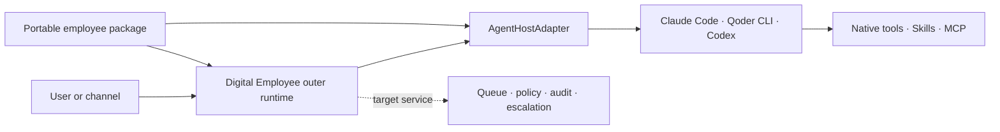
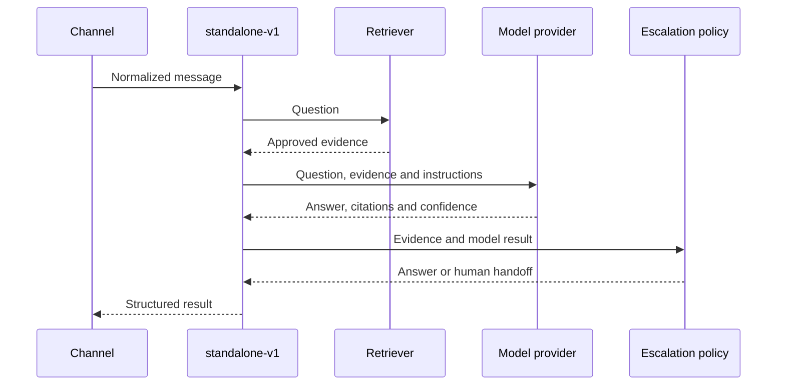

# Architecture

Digital Employee is an Agent-native employee packaging CLI and outer service
runtime. It reuses a capable Agent host instead of implementing a second
general-purpose Agent loop.

The normative boundary decision is recorded in
[ADR 0001](decisions/0001-agent-host-boundary.md).

## Two runtime layers



The inner Agent host owns:

- model access and the Agent/tool loop;
- context-window consumption and native sessions;
- native Skills, MCP, tools, sandbox and approval behavior;
- streaming, cancellation and provider usage when available.

The outer Digital Employee runtime owns:

- the portable employee package and host projection;
- host discovery, capability negotiation and normalized events;
- channels, acknowledgement, deduplication, queues and retries;
- policy checks, secret references, audit, escalation and observability;
- process or service packaging around a host installed by the operator.

This is the target ownership boundary, not a claim that the Agent-native
online service is already shipped. The current new path delivers package
scaffolding, package-aware validation, host diagnosis and one-shot Qoder runs.
Channels and queues in this repository still belong to `standalone-v1` until
they are moved behind an Agent-host service command.

The outer layer does not call a host as if it were a plain text-completion
model and then run another tool loop around it. It also does not persist or
require private chain-of-thought.

## Portable employee source package

The source of truth is host-neutral:

```text
employee.json                 Identity, host requirements and policy
SKILL.md                      Role, trigger, workflow and escalation rules
schemas/input.schema.json     Public task contract
schemas/output.schema.json    Public result contract
knowledge/                    Approved local knowledge
evals/                        Portable behavior cases
```

MCP declarations can add document, drive, DWS, memory or business tools. Host
files such as `AGENTS.md`, Claude/Qoder settings and command-line arguments are
generated projections, not the canonical employee definition. See
[the employee package contract](employee-package.md).

An employee may declare role-specific host capabilities, while security
requirements are also derived from its policy. For example, read-only derives
tool-surface restriction, path grants derive filesystem scoping, and denied
network access derives network enforcement. The author cannot bypass these
requirements by omitting a capability.

An adapter reports `documented`, `supported`, `unsupported` or `unknown` for
every capability. `documented` means official host functionality exists;
`supported` is reserved for an implemented adapter and a host range covered by
that adapter's deterministic repository fixtures. These fixtures are not a
reusable third-party certification harness. Only `supported` satisfies a
requirement. In particular, a prompt that asks the Agent to be read-only cannot
substitute for a tool boundary the host actually enforces.

The normalized `agent-host.v1` event contract includes run lifecycle,
assistant deltas, tool lifecycle, approval, usage, completion and failure
events. Native event formats remain inside each adapter.

## Current migration state

The new Agent-host foundation ships these non-model commands:

- `init`: creates a minimal host-neutral employee source package and never
  overwrites an existing target;
- `validate`: statically validates the manifest, Skill identity, declared
  files and JSON contracts; `--engine` also runs the selected adapter's
  model-free package/policy preflight and capability negotiation;
- `doctor`: performs a bounded local readiness probe for Claude Code, Qoder
  CLI and Codex and reports separately whether an adapter is runnable.

These commands do not start a model run or claim that model entitlement is
valid. The first real execution path, `run --engine qoder`, supports Qoder CLI
1.1.x through a version-gated Adapter covered by deterministic child-process
fixtures, with a new stateless session, read-only local assets, denied tool/MCP
data-plane network access, and no MCP or attachments.
It builds a per-run minimum projection, isolates Qoder configuration, filters
the child environment, restricts tools to `Read/Grep/Glob`, and validates the
native `system/init` policy report before forwarding events. It performs the
Qoder `initialize` handshake and sends Skill/task data over stdin JSONL rather
than process arguments. The adapter explicitly enables SDK process mode,
projects the PAT through a per-run mode-`0600` authentication file, and rejects
missing or cross-major protocol reports plus missing Skill/plugin attestations.
Each native message is validated before any of its normalized events are
published; a protocol failure discards buffered assistant/tool output. Run IDs
are reserved before staging, and the terminal event is held until process,
credential, temporary-root and reservation cleanup finishes; cancellation,
deadline and projected-file identity checks therefore apply before launch as
well as during execution. The final result must be strict JSON that passes the
employee output Schema. Claude Code and Codex remain probe-only.

`network: deny` applies to employee tool and MCP data-plane egress. The Agent
host's authentication and model control plane remains available; this
distinction is required for any host backed by a remote model.

## `standalone-v1` compatibility runtime

The explicit `legacy ask|sync|start|serve` namespace remains compatible with
the first release. The old top-level names are deprecated aliases through
`0.x`. Agent-native commands do not eagerly import this runtime and never
fallback to it when a selected host fails. Internally, this compatibility path
owns retrieval, model invocation, sessions, citations, feedback and
escalation:



This is retained for the credential-free demo and existing deployments under
the name `standalone-v1`. It receives compatibility and security fixes, but it
is not the target for new general Agent capabilities. The old
`employee-profile.v1` manifest describes this compatibility runtime; new
Agent-native packages use `employee-package.v1alpha1`.

## Service packaging learned from the DWS answer bot

The DWS Workbench answer bot is a useful implementation reference because its
long-running Node service owns DingTalk Stream, deduplication, queuing,
attachments, memory and escalation, while Claude Code or Qoder CLI owns the
Agent loop. Digital Employee generalizes that boundary into contracts.

It does not copy DWS-specific prompt content, hard-coded repository indexing,
private knowledge, expert lists or a growing host-selection branch. DWS is an
optional MCP/capability layer, not a core dependency.

## Repository layout

```text
apps/cli/                     CLI, package runner, host registry and adapters
apps/server/                  standalone-v1 HTTP compatibility wrapper
packages/core/                Package, host and standalone contracts
connectors/                   standalone-v1 channels, models and sources
profiles/answer-agent/        standalone-v1 compatibility profile
configs/                      Public schemas and credential-free examples
docs/decisions/               Architecture decision records
```

## Product boundary

This repository builds and packages employees. A future marketplace or
management platform may register packages, dispatch jobs, meter usage, collect
ratings and settle payments, but pricing, rental, billing, revenue sharing and
multi-tenant hosting are not part of this core CLI/runtime.

WorkBuddy is currently treated as an upper-level workbench and context/MCP
gateway. It is not a peer Agent host until it exposes a stable headless run,
event, cancellation and enforceable policy contract.
