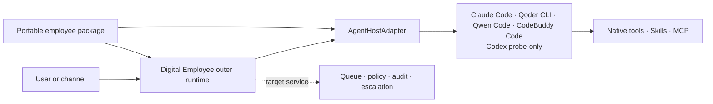
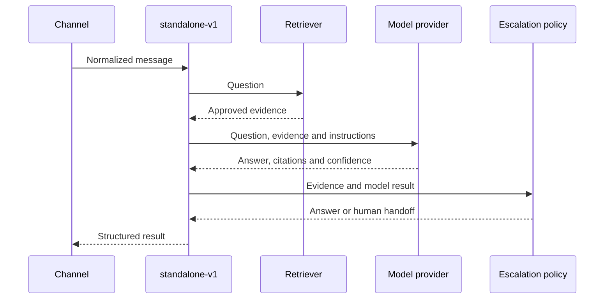

# Architecture

Digital Employee is an Agent-native employee packaging CLI and outer service
runtime. It reuses a capable Agent host instead of implementing a second
general-purpose Agent loop.

The [product strategy](strategy.md) is the normative scope contract, and the
[roadmap](roadmap.md) maps that contract to delivery gates and issues. This
document describes architectural ownership; it does not promote a target
component to shipped status.

The normative Host boundary is recorded in
[ADR 0001](decisions/0001-agent-host-boundary.md); the publisher-owned Runner
boundary is recorded in [ADR 0002](decisions/0002-runner-execution-boundary.md).

## Two runtime layers



The inner Agent host owns:

- model access and the Agent/tool loop;
- context-window consumption and native sessions;
- native Skills, MCP, tools, sandbox and approval behavior;
- streaming, cancellation and provider usage when available.

The outer Digital Employee runtime owns:

- the portable employee package and host projection;
- host discovery, capability negotiation and normalized events;
- channels, acknowledgement, deduplication, queues and retries;
- policy checks, secret references, audit, escalation and observability;
- process or service packaging around a host installed by the operator.

This is the target ownership boundary, not a claim that the Agent-native
online service is already shipped. The current new path delivers package
scaffolding, package-aware validation, host diagnosis and version-gated
one-shot runs through Qoder CLI, Claude Code, Qwen Code and CodeBuddy Code. It
also delivers one fail-closed local package-bound deployment slot: HTTP may
become ready after exact local readback, Console remains pending for an
attached foreground process, and DingTalk application reconciliation is on a
fail-closed external HOLD because current DWS list output omits required
pagination metadata. The multi-deployment registry, queue, audit, reconnect,
and long-running Agent-host service remain target design. The older general
channel runtime remains the explicit `standalone-v1` compatibility path.

The outer layer does not call a host as if it were a plain text-completion
model and then run another tool loop around it. It also does not persist or
require private chain-of-thought.

### Target ownership versus shipped maturity

| Boundary | Target owner | Current source maturity |
| --- | --- | --- |
| Employee package, CLI and Host projection | Open framework on the operator machine | Authoring commands are shipped in source |
| Agent execution and native tool loop | Installed Agent Host | Four locked one-shot paths are preview and fixture-conformant; Codex is probe-only |
| Single-host package-bound deploy | Open framework on the operator machine | One local slot is shipped in source; HTTP has verified readiness, Console remains pending, DingTalk is blocked by the external DWS pagination contract, Lark/WeCom unsupported |
| One-shot task verification and receipt | Open Runner kernel on the operator machine | Preview embeddable implementation is delivered |
| Long-running Runner lifecycle, local deployment registry, durable replay/outbox and reconnect | Open framework on the operator machine | Target design; not delivered |
| Device registration, scheduling, trusted usage verification, Quote/Credit and settlement | Separate private control plane | Private; not implemented by this repository |

## Publisher-owned Runner boundary

Every application/service employee executes on its publisher or operator's
own computer or server. A private marketplace control plane may create tasks,
reserve Credits and settle independently verified usage, but it never runs an
employee package, stores its local path, or holds an Agent Host credential.

The current source preview delivers the transport-neutral one-shot execution
kernel:

- deterministic package digests over exact declared bytes;
- per-run sealed local package snapshots;
- Ed25519 task and receipt envelopes with distinct signature domains;
- signed full-payload lease renewals, 30-second clock-skew tolerance and
  half-open validity windows;
- attempt/fencing identity, replay-guard port and a 5-second upload margin;
- bounded hash-chained events and receipt-bound event/usage summaries.

The Runner is always an outbound client. The current source does not provide a
long-running network daemon, local deployment registry, device-key lifecycle,
durable replay/outbox store, reconnect loop or platform HTTP/gRPC client. Those
are public Runner-client targets, not private server responsibilities. See
[the Runner integration path](runner.md).

## Portable employee source package

The source of truth is host-neutral:

```text
employee.json                 Identity, host requirements and policy
SKILL.md                      Role, trigger, workflow and escalation rules
schemas/input.schema.json     Public task contract
schemas/output.schema.json    Public result contract
knowledge/                    Approved local knowledge
evals/                        Offline fixture contract cases
```

MCP declarations can add document, drive, DWS, memory or business tools. Host
files such as `AGENTS.md`, Claude/Qoder settings and command-line arguments are
generated projections, not the canonical employee definition. See
[the employee package contract](employee-package.md).

The fixed contract eval asset is declared as `./evals/cases.json`. Its JSON has
exact top-level `{schemaVersion,cases}` and case
`{id,input,expectedOutput}` shapes; fixtures are checked only against the
package input/output Schemas. The command neither invokes nor evaluates a
model, Agent, Agent Host, MCP, online service, live response or response
quality. Machine output uses `employee-eval-result.v1alpha1`; a passed contract
eval exits `0`, while a package, contract or fixture-conformance failure
returns a stable machine code and exits `1`.

An employee may declare role-specific host capabilities, while security
requirements are also derived from its policy. For example, read-only derives
tool-surface restriction, path grants derive filesystem scoping, and denied
network access derives network enforcement. The author cannot bypass these
requirements by omitting a capability.

An adapter reports `documented`, `supported`, `unsupported` or `unknown` for
every capability. `documented` means official host functionality exists;
`supported` is reserved for an implemented adapter and a host range covered by
that adapter's deterministic repository fixtures. These fixtures are not a
reusable third-party certification harness. Only `supported` satisfies a
requirement. In particular, a prompt that asks the Agent to be read-only cannot
substitute for a tool boundary the host actually enforces.

The normalized `agent-host.v1` event contract includes run lifecycle,
assistant deltas, tool lifecycle, approval, usage, completion and failure
events. Native event formats remain inside each adapter.

## Current migration state

The new Agent-host foundation ships these non-model commands:

- `init --recipe minimal-answer.v1|structured-action.v1`: creates a versioned,
  host-neutral employee source package and never overwrites an existing target;
- `validate`: statically validates the manifest, Skill identity, declared
  files and JSON contracts; `--engine` also runs the selected adapter's
  model-free package/policy preflight and capability negotiation;
- `eval [directory] [--json]`: performs offline fixture conformance
  with stable `employee-eval-result.v1alpha1` output and exit `0|1` semantics;
- `doctor`: performs a bounded local readiness probe for Claude Code, Qoder
  CLI, Codex, Qwen Code and CodeBuddy Code and reports separately whether an
  adapter is runnable;
- `deploy [package-path]`: binds an exact package/runtime and records one
  secret-safe local deployment outcome. It is not the future multi-employee
  service, registry, queue, or remote Runner lifecycle.

These commands do not start a model run or claim that model entitlement is
valid. Four real execution paths are covered by Adapter-specific deterministic
fixtures in this repository:

- Qoder CLI 1.1.x receives a per-run minimum read-only file projection. Its
  isolated SDK-process configuration restricts native tools to the exact
  `Read/Grep/Glob` set when local assets are present and requires empty MCP,
  Skill and plugin attestations. Assistant text is buffered until successful
  process and credential cleanup, then scrubbed as one value using the exact
  service credential. Tool values are scrubbed before truncation,
  credential-bearing tool identifiers and keys are rejected, and schema-bound
  structured output that would require credential or pattern redaction fails
  closed.
- Claude Code `>=2.1.214 <2.2.0`, Qwen Code `0.17.1` and CodeBuddy Code
  `2.106.4` are context-only. An adapter reads only manifest-selected,
  policy-allowed, bounded UTF-8 regular files, seals their path, length, digest
  and content into the stdin task value, then launches the host in empty
  isolated workspace, home and configuration directories. Every model-visible tool
  and MCP surface must attest empty before output is trusted. Claude also
  attests empty plugin/Skill/slash-command surfaces; Qwen disables slash
  commands and pins its non-callable built-in agent catalog; CodeBuddy carries
  a version-complete deny list because `--tools ""` alone does not clear 2.106.4.

All four use a new stateless session, filtered environment, stdin/native stream
transport and an explicit deployment service API key rather than a personal
CLI login. They reject MCP, attachments, resume, writes and approval callbacks.
The runnable preview is POSIX-only: a terminal event is withheld until the
detached process group has exited. Windows remains not-ready until equivalent
Job Object process-tree cleanup is implemented and covered by deterministic
Adapter fixtures.

Across all built-in Adapters, `structured_output` has one meaning:
**Adapter-enforced terminal validity**. When `outputSchema` is present, the
Adapter prepares one bounded, immutable, synchronous Schema snapshot for both
projection and terminal validation. The terminal JSON value in `run.completed`
must be accepted unchanged by that snapshot. Repair, coercion, defaults, field
removal, or redaction cannot manufacture conformance; if post-validation safety
scrubbing would mutate a schema-bound value, the run fails closed. Invalid JSON,
asynchronous Schema, Schema mismatch, cancellation, deadline, or cleanup failure
also fails closed. This capability does not claim Host-native constrained
generation; JSONL or another machine-readable event format alone is
insufficient. Qoder additionally limits Schema snapshots to 16 KiB and compiles
them before its version probe, projection, or model process.
Each native message is validated before normalized events are published; a
protocol failure discards buffered output. Run IDs are reserved before staging,
and the terminal event is held until process, credential, temporary-root and
reservation cleanup finishes, so cancellation, deadline and projected-file
identity checks apply before launch as well as during execution. The final
result must pass the employee output Schema. These fixtures are not a reusable
third-party certification harness; live model entitlement has not been tested.

Codex remains probe-only. Codex CLI 0.148.0 cannot reliably remove every
model-visible built-in tool: disabling shell and unified execution still leaves
paths such as `apply_patch`. Consequently it cannot claim the required
default-deny `tool_allowlist`, even with a read-only filesystem policy.

`network: deny` applies to employee tool and MCP data-plane egress. The Agent
host's authentication and model control plane remains available; this
distinction is required for any host backed by a remote model.

## `standalone-v1` compatibility runtime

The explicit `legacy ask|sync|start|serve` namespace remains compatible with
the first release. The old top-level names are deprecated aliases through
`0.x`. Agent-native commands do not eagerly import this runtime and never
fallback to it when a selected host fails. Internally, this compatibility path
owns retrieval, model invocation, sessions, citations, feedback and
escalation:



This is retained for the credential-free demo and existing deployments under
the name `standalone-v1`. It receives compatibility and security fixes, but it
is not the target for new general Agent capabilities. The old
`employee-profile.v1` manifest describes this compatibility runtime; new
Agent-native packages use `employee-package.v1alpha1`.

## Service packaging learned from the DWS answer bot

The DWS Workbench answer bot is a useful implementation reference because its
long-running Node service owns DingTalk Stream, deduplication, queuing,
attachments, memory and escalation, while Claude Code or Qoder CLI owns the
Agent loop. Digital Employee generalizes that boundary into contracts.

It does not copy DWS-specific prompt content, hard-coded repository indexing,
private knowledge, expert lists or a growing host-selection branch. DWS is an
optional MCP/capability layer, not a core dependency.

## Repository layout

```text
apps/cli/                     CLI, package runner, host registry and adapters
apps/server/                  standalone-v1 HTTP compatibility wrapper
packages/core/                Package, host and standalone contracts
connectors/                   standalone-v1 channels, models and sources
profiles/answer-agent/        standalone-v1 compatibility profile
configs/                      Public schemas and credential-free examples
docs/decisions/               Architecture decision records
```

## Product boundary

This repository builds, packages and executes employees on publisher-owned
machines. The separate private marketplace control plane registers immutable
release identities, dispatches signed jobs, verifies usage and settles
Credits. Pricing, rental, billing, ratings, revenue sharing and marketplace
accounts are intentionally not part of this framework. The platform must not
import Host Adapter execution code or become an employee hosting service.

Tencent WorkBuddy GUI is currently treated as an upper-level workbench and
context/MCP gateway. It is not a peer Agent host until it exposes a stable
headless run, event, cancellation and enforceable policy contract. The
programmable Tencent host integrated here is CodeBuddy Code.
