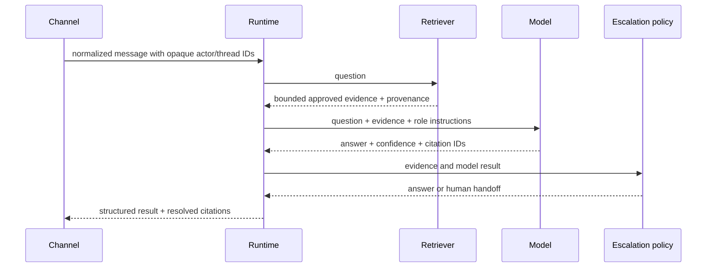

# Architecture

Digital Employee separates reusable runtime concerns from role-specific
behavior.

## Contracts

- **Channel** accepts a provider event, normalizes it to a message, and sends
  a reply. Raw provider identities do not enter the core.
- **Knowledge source** loads explicitly approved documents with stable source
  metadata.
- **Retriever** selects bounded evidence and produces citations.
- **Model provider** returns an answer, confidence, citation IDs, and an
  optional human-review request.
- **Role profile** defines instructions and permission defaults.
- **Escalation policy** makes the final deterministic decision about human
  handoff.
- **Feedback store** learns only from answered exchanges whose verified
  feedback is authorized by an injected trusted reviewer boundary.
- **Tool** declares read/write mode. The `answer-agent` profile blocks write
  tools before execution.

## Answer path



The model cannot create citations: the runtime resolves only IDs present in
the retrieved evidence set.

FAQ learning also defaults to deny. A host application must inject an
`authorizeFeedback` function into `DigitalEmployee`, then pass trusted
authorization context separately as the second argument to
`recordFeedback(payload, authorizationContext)`. User-controlled fields in
the feedback payload cannot self-authorize learning, and escalated or failed
exchanges are never promoted.

## Package layout

```text
apps/                         TypeScript CLI and HTTP entry points
packages/core/                TypeScript runtime, sessions, queue, retrieval, feedback
connectors/channels/          TypeScript Console and DingTalk channels
connectors/sources/           TypeScript Filesystem, Git and optional DWS sources
connectors/models/            TypeScript Extractive and OpenAI-compatible providers
profiles/answer-agent/        First TypeScript role profile
configs/                      Public, credential-free examples
examples/knowledge/           Reproducible public fixture
dist/                         Generated ESM, declarations, source maps, public assets
```

`tsconfig.json` is the shared strict contract and `tsconfig.build.json` emits
the deployable ESM graph. Tests are TypeScript executed by `tsx` against the
same source contracts. npm exports, workspace package exports, the CLI, and
the container all execute compiled JavaScript. Files in `scripts/*.js` are
non-runtime build, security, and release helpers.

## Digital employee versus answer agent

The core does not contain a support persona or a DingTalk dependency.
`answer-agent` is the first profile and deliberately read-only. Future roles
should reuse the contracts rather than copy the runtime. Write-capable roles
must add an approval contract, preview, idempotency, and audit trail before any
write tool can be enabled.
