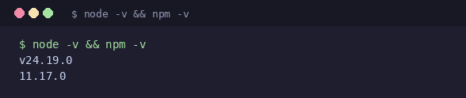
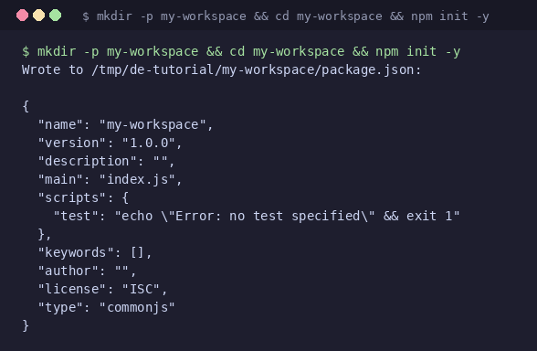
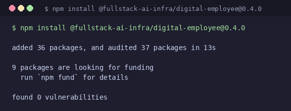
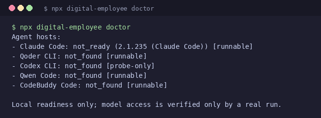
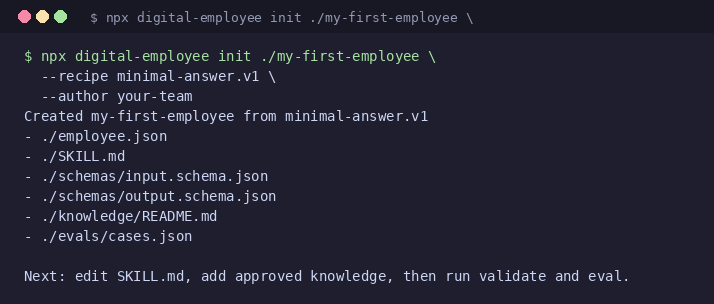
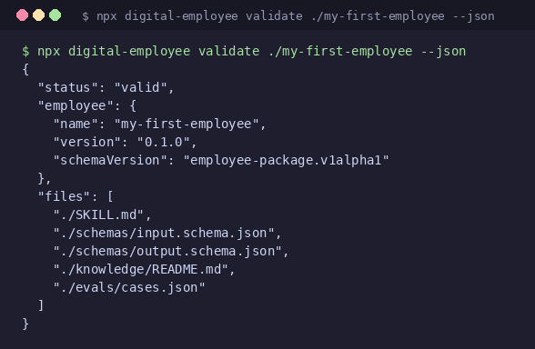
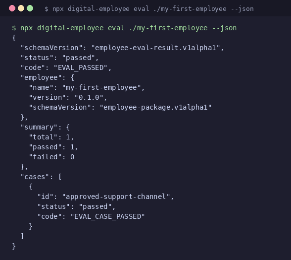
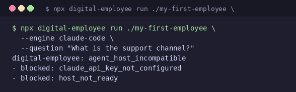
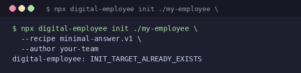
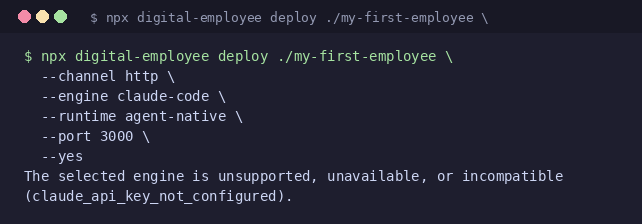

# 30 分钟上手 Digital Employee

本文档是一个独立、可复现的新手教程。你不需要 AI/Agent 背景，会终端和 npm 即可。

## 面向读者

- 第一次接触 Digital Employee 的开发者
- 想快速验证"从零到员工包跑通"的新人

## 预计耗时

**30 分钟**（纯命令执行约 10 分钟，含阅读说明约 30 分钟）。

## 读完能得到什么

- 在自己的机器上跑通 Digital Employee 的**完整 credential-free 路径**（Step 0–6）
- 理解 `doctor → init → validate → eval` 四步验证链路
- 知道 `run` 需要什么条件、为什么它会在无凭据时 fail-closed
- 遇到两个最常见错误时能自行诊断
- 拿到一个可编辑的 `my-first-employee` 员工包，为后续自定义做好准备

## 前置条件

| 条件 | 检查方式 |
|------|----------|
| Node.js >= 20 | `node -v` |
| npm >= 10 | `npm -v` |
| 终端（任意 POSIX shell） | 能运行上述命令即可 |
| 网络（npm registry 可达） | `npm install` 能下载包 |
| （可选）一个 Agent Host 已安装 | 有则 `doctor` 显示 ready；无也不影响 Step 0–6 |

> **Windows 用户**：请使用 WSL2 或 Git Bash。本教程的命令在 PowerShell 或 CMD 下未经测试，POSIX shell 是已验证的环境。

**不需要**：API key、模型凭据、GitHub 账号、Docker、源代码克隆。

---

## Step 0：检查环境

### 为什么做

确认 Node.js 和 npm 版本满足最低要求（>=20 + >=10），避免后面步骤报错时无法定位原因。

### 精确命令

```bash
node -v && npm -v
```

### 截图



### 如何判断成功

输出版本号，且 Node.js 主版本 >= 20，npm 主版本 >= 10。示例输出：

```
v24.19.0
11.17.0
```

### 失败了怎么办

| 现象 | 对策 |
|------|------|
| `node: command not found` | 先安装 Node.js。推荐 [nvm](https://github.com/nvm-sh/nvm)（Linux/macOS）或 [fnm](https://github.com/Schniz/fnm)（跨平台） |
| Node.js 主版本 < 20 | 用 nvm/fnm 安装 20+：`nvm install 20 && nvm use 20` |
| npm 主版本 < 10 | `npm install -g npm@latest` |

---

## Step 1：创建工作空间

### 为什么做

在空目录中初始化 npm 项目，作为后续安装 digital-employee 的容器。隔离环境，避免污染已有项目。

### 精确命令

```bash
mkdir -p my-workspace && cd my-workspace && npm init -y
```

### 截图



### 如何判断成功

终端打印 `Wrote to .../package.json`，且当前目录下生成了 `package.json`。用 `ls` 确认：

```bash
ls package.json   # 应显示 package.json
```

### 失败了怎么办

| 现象 | 对策 |
|------|------|
| `mkdir: Permission denied` | 切换到有写权限的目录（如 `/tmp` 或 `~/projects`） |
| `npm init -y` 无输出或报错 | 检查 npm 版本：`npm -v`。如果 < 10，先升级 npm |
| `cd: no such file or directory` | 检查 `mkdir` 是否成功。如果目录名含空格，加引号 |

---

## Step 2：安装 Digital Employee

### 为什么做

从 npm registry 下载 0.4.0 公开发行版，安装到工作空间的 `node_modules/`。这是整个教程中唯一需要网络的步骤。

### 精确命令

```bash
npm install @fullstack-ai-infra/digital-employee@0.4.0
```

### 截图



### 如何判断成功

终端输出包含 `added` 和 `found 0 vulnerabilities`：

```
added N packages, and audited M packages in Xs
found 0 vulnerabilities
```

> 包数量可能因版本略有不同，关键是 `found 0 vulnerabilities` 和没有 `ERR!` 错误行。

### 失败了怎么办

| 现象 | 对策 |
|------|------|
| 网络超时或 `ETIMEDOUT` | 检查 npm registry 可达性：`npm ping`。如果公司的 registry 不可用，换用官方源：`npm config set registry https://registry.npmjs.org/` |
| `EACCES` 或 `E PERMISSION` | 检查当前目录写权限。如果你在 Step 1 的 `my-workspace` 下，权限应该没问题。如果坚持用全局安装，加 `--global` 但不再推荐 |
| `npm warn allow-scripts` 关于 `esbuild` | **无害，可忽略。**这是 esbuild 的 postinstall 脚本，不影响功能 |
| 提示 `@fullstack-ai-infra/digital-employee@0.4.0` 未找到 | 检查三点：scope 是 `@fullstack-ai-infra`（不要漏掉 `@`），包名是 `digital-employee`（不要写成 `digital-employees`），版本号 `@0.4.0` 不要省略。确认 npm registry 可用：`npm ping` |

---

## Step 3：诊断 Agent Host（doctor）

### 为什么做

扫描本地已安装的 Agent Host（Qoder CLI、Claude Code、Qwen Code、CodeBuddy Code），报告每个 Host 的状态。这是 credential-free 的第一步验证——不调用模型，不消耗任何凭据。

### 精确命令

```bash
npx digital-employee doctor
```

### 截图



### 如何判断成功

输出各个 Agent Host 的探测结果列表，以 `Local readiness only; model access is verified only by a real run.` 结尾。

- 有 Host 显示 `[runnable]` 为最佳
- 全部 `not_found` 也**不影响后续步骤**——Step 4–6 完全不需要 Host

### 失败了怎么办

| 现象 | 对策 |
|------|------|
| `npx: command not found` 或找不到 `digital-employee` | 检查 Step 2 是否安装成功、当前目录是否在 `my-workspace` 下。运行 `ls node_modules/.bin/digital-employee` 确认二进制文件存在 |
| `doctor` 没有输出直接退出 | 这是 bug，不是你的操作问题。请带上 `--json` 重试：`npx digital-employee doctor --json`，并在 GitHub Issues 中报告 |
| 所有 Host 都显示 `not_found` | 正常。`doctor` 的设计就是如实报告——它不会因为"没有 Host"而失败，它只会告诉你"我找了，没找到" |

---

## Step 4：创建员工包（init）

### 为什么做

从公开 recipe `minimal-answer.v1` 脚手架一个员工包目录，包含 `employee.json`、`SKILL.md`、schema 文件、knowledge 目录和 eval 用例。这是你后续编辑和自定义的起点。

### 精确命令

```bash
npx digital-employee init ./my-first-employee \
  --recipe minimal-answer.v1 \
  --author your-team
```

### 截图



### 如何判断成功

终端输出 `Created my-first-employee from minimal-answer.v1`，列出 6 个生成的文件路径，并以 `Next: edit SKILL.md, add approved knowledge, then run validate and eval.` 结尾。

用 `ls` 确认目录结构：

```bash
ls -R my-first-employee/
```

应看到 `employee.json`、`SKILL.md`、`schemas/`、`knowledge/`、`evals/`。

### 失败了怎么办

| 现象 | 对策 |
|------|------|
| `INIT_TARGET_ALREADY_EXISTS` | 目标目录已存在。删除后重试：`rm -rf my-first-employee`，或换一个名字：`./my-second-employee` |
| 参数错误或无输出 | 检查 `--recipe` 是否拼写正确：`minimal-answer.v1` 是完整名称，不要漏掉 `.v1` 版本号 |
| 提示 `Unknown recipe` | 确认 recipe 名称无误。当前公开 recipe 只有 `minimal-answer.v1` |

---

## Step 5：验证员工包（validate）

### 为什么做

检查员工包的结构完整性——必需文件是否齐全、schema 是否有效、manifest 是否符合 employee-package 合约。这是 credential-free 的第二步验证。

### 精确命令

```bash
npx digital-employee validate ./my-first-employee --json
```

### 截图



### 如何判断成功

JSON 输出中 `"status": "valid"`，`files` 数组列出 5 个已验证文件，`employee.schemaVersion` 为 `"employee-package.v1alpha1"`。

### 失败了怎么办

| 现象 | 对策 |
|------|------|
| `"status": "invalid"` | 检查是否手动编辑过 scaffold 文件导致格式错误。用 `--json` 获取机器可读的错误详情，定位具体是哪个文件出了问题 |
| 提示找不到某个文件 | 确认 `my-first-employee/` 目录完整，没有被误删。必要时重新运行 Step 4 |
| 提示 schema 校验失败 | 如果你没改过 `schemas/` 下的文件，这不应该发生。如果发生了，请报告 |

---

## Step 6：运行评测用例（eval）

### 为什么做

运行员工包自带的 eval case，验证知识库、schema 和预期行为的一致性。这是 credential-free 的第三步验证——也是交付前最后一道纯静态检查。

### 精确命令

```bash
npx digital-employee eval ./my-first-employee --json
```

### 截图



### 如何判断成功

JSON 输出中 `"status": "passed"`，`summary.passed >= 1` 且 `summary.failed == 0`。case `approved-support-channel` 的状态为 `"status": "passed"`。

### 失败了怎么办

| 现象 | 对策 |
|------|------|
| `"status": "failed"` | 查看 `cases` 数组中哪个 case 失败了（`"status": "failed"`），检查对应 knowledge 文件是否被修改或删除 |
| 所有 case 都失败 | 可能 `knowledge/` 目录被清空或 `evals/cases.json` 被修改。重新 `init` 一份干净的员工包对比：`diff -r my-first-employee/ my-first-employee-fresh/` |
| 输出不含 `--json` 选项时的可读摘要 | 如果你忘记了 `--json`，eval 会输出人类可读的表格。加上 `--json` 重试即可 |

---

## Step 7：首次运行（run — 预期 fail-closed）

### 为什么做

尝试一次真正的 Agent 运行。**在无凭据的情况下，这个命令会 fail-closed**——这正是我们想展示的：framework 在缺失 API key 时安全拒绝，而不是悄悄执行或给出不可信的结果。

### 精确命令

```bash
npx digital-employee run ./my-first-employee \
  --engine claude-code \
  --question "What is the support channel?"
```

### 截图



### 如何判断成功

**预期失败。**输出应包含：

```
digital-employee: agent_host_incompatible
- blocked: claude_api_key_not_configured
- blocked: host_not_ready
```

这两个 `blocked` 说明 framework 的安全机制正常工作——它检测到：
1. 没有 API key；
2. Host 未就绪；

于是拒绝执行，而不是给出不可信的结果。

### 失败了怎么办

> 这是 Step 7 的独特之处：这里的"失败"恰好是"成功"。

| 现象 | 含义 |
|------|------|
| 命令报错，输出 `agent_host_incompatible` | ✅ **正确！** framework 按预期 fail-closed |
| 命令没有报错，输出了一段回答 | 你的环境已经配置了 `ANTHROPIC_API_KEY`。这是好事——你已可以跑真正的 live run。跳到"下一步"继续 |
| 报错 `engine not found` 或 `unknown engine` | 检查 `--engine` 参数是否拼写正确。支持的值：`claude-code`、`qoder`、`qwen-code`、`codebuddy` |
| 报错 `claude-code: not_found` | 你选了 `claude-code` 但机器上没有安装 Claude Code。换一个已安装的 engine，或安装 Claude Code |

---

## FAQ

### `init` 报 `INIT_TARGET_ALREADY_EXISTS`

目标目录已存在。删除后重试：

```bash
rm -rf my-first-employee
npx digital-employee init ./my-first-employee --recipe minimal-answer.v1 --author your-team
```

或者换一个名字：

```bash
npx digital-employee init ./my-second-employee --recipe minimal-answer.v1 --author your-team
```



### `deploy` 报 `claude_api_key_not_configured`

需要设置 `ANTHROPIC_API_KEY` 环境变量：

```bash
export ANTHROPIC_API_KEY='your-api-key-here'
npx digital-employee deploy ./my-first-employee \
  --channel http --engine claude-code --runtime agent-native --port 3000 --yes
```

其他 Host 的凭据配置详见 [INSTALL.md](../../INSTALL.md) 的 Per-Host 配置表。



### `doctor` 说 `runnable: false`，是不是坏了？

不是。`runnable: false` 表示 Host 二进制找到了但没配置 API key——这是正常的，说明你还没到需要凭据的步骤。`doctor` 本身不需要也不应该要求 API key。

### 我没有任何 Agent Host 能继续吗？

能。Step 0–6 完全不需要 Agent Host。Step 7 会优雅地失败（fail-closed），这正是我们想展示的安全行为。等你装了 Host 再回来看 Step 7 即可。

### `npm install` 时出现 `allow-scripts` 警告

无害，是 `esbuild` 的 postinstall 脚本。不影响 Digital Employee 的任何功能。如果觉得碍眼，可以在 `.npmrc` 中配置 `ignore-scripts=true`，但不推荐——其他依赖可能需要 postinstall。

### 可以用源代码安装吗？

可以。克隆仓库后从源码构建：

```bash
git clone https://github.com/fullstack-ai-infra/digital-employee.git
cd digital-employee
npm ci
npm run build
```

然后用 `node ./dist/apps/cli/bin.js` 替代 `npx digital-employee`。例如：

```bash
node ./dist/apps/cli/bin.js init ./my-employee --recipe minimal-answer.v1 --author your-team
```

### 我改了 `SKILL.md` 之后 `validate` 失败了

`validate` 检查的是包结构完整性，不是 SKILL.md 的内容。如果你只改了 SKILL.md 且 `validate` 失败，检查是否不小心删除了其他文件，或 SKILL.md 是否包含了畸形的 YAML frontmatter。如果问题持续，重新 `init` 一份干净的包对比。

---

## 下一步

1. 编辑 `my-first-employee/SKILL.md` 定义员工角色（skill 内容、行为边界、回答风格）
2. 向 `knowledge/` 目录添加知识文件（Markdown 格式，放入员工需要引用的知识）
3. 更新 `evals/cases.json` 中的测试用例以匹配你的知识库
4. 重新运行 `validate` + `eval` 验证修改
5. 配置一个 Agent Host 的 API key，运行 `deploy` 体验完整链路
6. 阅读 [INSTALL.md](../../INSTALL.md) 了解各 Host 的凭据配置方式
7. 阅读 [docs/employee-package.md](../employee-package.md) 了解员工包合约的完整规范

---

## 术语小词典

| 术语 | 解释 |
|------|------|
| **Digital Employee** | 本框架——一个开源 CLI，管理员工包完整性、策略、Host 适配和执行证据。不存储凭据，不托管模型 |
| **Agent Host** | 模型推理宿主（Qoder CLI、Claude Code、Qwen Code、CodeBuddy Code）——负责模型循环；框架负责包安全、策略和实施证据 |
| **Employee Package** | 员工包——包含 `employee.json`、`SKILL.md`、schema、knowledge、evals 的目录，由 `init` 创建 |
| **Recipe** | 公开的脚手架模板（如 `minimal-answer.v1`），决定 `init` 生成哪些文件及它们的初始内容 |
| **doctor** | 诊断命令——探测本地已安装的 Agent Host，不调用模型，不需要凭据 |
| **validate** | 验证命令——检查员工包结构完整性，确保所有必需文件存在且格式正确 |
| **eval** | 评测命令——运行员工包内置的测试用例，验证知识库、schema 和预期行为的一致性 |
| **run** | 一次性的 Agent 执行——需要 API key，是真正的模型调用。以 `--stdin` 或 `--question` 传入任务 |
| **deploy** | 部署命令——将已验证的包绑定到一个真实的部署结果（HTTP 服务等），需要 API key |
| **fail-closed** | 安全失败原则——缺少凭据、权限不足或环境不满足时拒绝执行，而不是悄悄绕过或给出不可信的结果 |
| **credential-free** | 不需要 API key 或凭据即可完成的操作。doctor、init、validate、eval 都是 credential-free 的 |