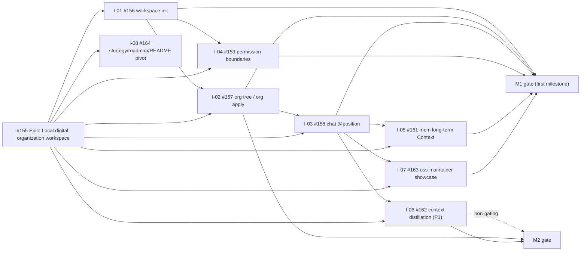

# Digital Employee roadmap

[简体中文](roadmap.zh-CN.md)

This roadmap turns the stable [product strategy](strategy.md) into an
executable issue graph. [Epic #155](https://github.com/fullstack-ai-infra/digital-employee/issues/155)
(Local digital-organization workspace) is the delivery index for the new
mainline; [Epic #25](https://github.com/fullstack-ai-infra/digital-employee/issues/25)
stays open only as the old-track wrap-up index. Issue labels and milestones are
the source of truth for current status; this document defines sequence,
ownership and acceptance gates, not delivery dates or full issue
specifications.

## Shipped baseline

| Area | Evidence in the current source | Maturity and remaining boundary |
| --- | --- | --- |
| Employee-package authoring | Host-neutral `init`, package-aware `validate`, bounded `doctor`, the `minimal-answer.v1` and `structured-action.v1` recipes, and executable offline contract evals | **shipped** in current source and the public `0.4.0` artifact; fixture eval does not prove live model entitlement |
| Local Agent Host execution | Version-gated one-shot paths for Qoder CLI, Claude Code, Qwen Code and CodeBuddy Code | **preview** and **fixture-conformant**; live entitlement is not proven |
| Codex | Discovery and readiness diagnosis | **probe-only**; it is not a runnable Adapter |
| Runner kernel | Package digest and sealed snapshot, signed task/lease verification, replay port, hash-chained events and signed receipt for one task | **preview** embeddable kernel; no long-running Runner or public network SDK is shipped |
| Compatibility runtime | `standalone-v1` answer-agent runtime and connectors | **shipped** compatibility path; not the target for new mainline capabilities |
| Deploy command | Package-bound `deploy` with truthful local outcome and fail-closed recovery | **preview** surface; HTTP can reach `ready`; DingTalk reconciliation is externally HOLD |

The `workspace init`, `org tree` / `org apply` and `chat @position` commands
do **not** exist in the current source. They are **design** state owned by the
new mainline below.

## Delivery graph (new mainline)

The normative ordering is:

- **M1 (first milestone, marked):** [#156](https://github.com/fullstack-ai-infra/digital-employee/issues/156)
  → [#157](https://github.com/fullstack-ai-infra/digital-employee/issues/157)
  → [#158](https://github.com/fullstack-ai-infra/digital-employee/issues/158),
  with [#159](https://github.com/fullstack-ai-infra/digital-employee/issues/159)
  and [#161](https://github.com/fullstack-ai-infra/digital-employee/issues/161)
  closing the permission and memory loop, and
  [#163](https://github.com/fullstack-ai-infra/digital-employee/issues/163)
  proving the oss-maintainer showcase end to end.
- [#162](https://github.com/fullstack-ai-infra/digital-employee/issues/162)
  (context distillation) is P1 and non-gating for M1.
- [#164](https://github.com/fullstack-ai-infra/digital-employee/issues/164)
  (this pivot) is parallel and does not block M1.
- **M2:** context distillation depth and `org apply` lifecycle become the next
  gate. Channel output rendering
  ([#160](https://github.com/fullstack-ai-infra/digital-employee/issues/160))
  is owned outside this pivot and is not scheduled here.

## M1 — Digital-Organization Workspace (first milestone)

**User outcome:** a user turns one business directory into a directly
addressable AI team with long-term Context and permission boundaries, and
reproduces the first showcase case (oss-maintainer) end to end.

| Story | Deliverable | Dependency | Team |
| --- | --- | --- | --- |
| [#156](https://github.com/fullstack-ai-infra/digital-employee/issues/156) | `workspace init` prototype with oss-maintainer template | Epic #155 | Workspace |
| [#157](https://github.com/fullstack-ai-infra/digital-employee/issues/157) | Organization model with `org tree` / `org apply` | #156 | Org model |
| [#158](https://github.com/fullstack-ai-infra/digital-employee/issues/158) | `chat @position` conversation bridge (turn contract) | #102, #156 | Chat bridge |
| [#159](https://github.com/fullstack-ai-infra/digital-employee/issues/159) | Position permission boundaries (Context Scope + Authority Scope) | #156 | Governance |
| [#161](https://github.com/fullstack-ai-infra/digital-employee/issues/161) | Long-term Context integration (mem R1-level) | #158, mem #68 | Memory |
| [#163](https://github.com/fullstack-ai-infra/digital-employee/issues/163) | oss-maintainer showcase (quickstart form) | #156, #158 | Adoption |
| [#162](https://github.com/fullstack-ai-infra/digital-employee/issues/162) | Context fact distillation integration (rule-based) | #158, context | Context (P1, non-gating) |

**Gate:** clean-machine `workspace init` → `org tree` → `chat @position`
(owner and worker paths) works; Context slices are narrow and permission
boundaries hold; decisions persist to `mem` and a new session recalls them;
`org apply` preserves Context and recomputes permissions; the showcase is
reproducible from the quickstart; every claim uses the evidence vocabulary.

**Non-goals:** channels (CLI-only), marketplace/transaction work, full RBAC,
and Host-native session resume.

## M2 — Context depth and org lifecycle

**User outcome:** the workspace keeps learning: session text is distilled into
a rule-based entity graph, and `org apply` becomes the trusted way to change
the organization.

| Story | Deliverable | Dependency | Team |
| --- | --- | --- | --- |
| [#162](https://github.com/fullstack-ai-infra/digital-employee/issues/162) | Rule-based context distillation drives narrow-slice recall | #158, context | Context |
| [#157](https://github.com/fullstack-ai-infra/digital-employee/issues/157) | `org apply` audits organizational changes | #156 | Org model |

**Non-goals:** channel expansion (Lark/WeCom), marketplace/transaction work,
and full RBAC.

## Old-track wrap-up and issue disposition

The old mainline (**Builder → Seller Runner → Trusted execution**, epic #25)
is wrapping up and is not extended. Every open issue carries an explicit
**KEEP / REPURPOSE / PARK** disposition. KEEP joins the new mainline;
REPURPOSE is re-scoped onto the workspace command surface; PARK freezes after
the old track wraps up. Dispositions are recorded, not destructive: issues are
not mass-rewritten or closed by this roadmap, and a future engineering issue
executes any disposition that implies code.

### New mainline (Epic #155 and its sub-issues)

| Issue | Title | Disposition |
| --- | --- | --- |
| [#155](https://github.com/fullstack-ai-infra/digital-employee/issues/155) | [Epic] Local digital-organization workspace | **KEEP** — new mainline delivery index; supersedes #25 as North Star |
| [#156](https://github.com/fullstack-ai-infra/digital-employee/issues/156) | feat(workspace): `workspace init` prototype | **KEEP** — M1 |
| [#157](https://github.com/fullstack-ai-infra/digital-employee/issues/157) | feat(org): organization model, `org tree` / `org apply` | **KEEP** — M1 |
| [#158](https://github.com/fullstack-ai-infra/digital-employee/issues/158) | feat(chat): `chat @position` conversation bridge | **KEEP** — M1 |
| [#159](https://github.com/fullstack-ai-infra/digital-employee/issues/159) | feat(org): position permission boundaries | **KEEP** — M1 |
| [#161](https://github.com/fullstack-ai-infra/digital-employee/issues/161) | feat(mem): long-term Context integration (R1-level) | **KEEP** — M1 |
| [#162](https://github.com/fullstack-ai-infra/digital-employee/issues/162) | feat(context): fact distillation integration (rule-based) | **KEEP** — M2 (P1) |
| [#163](https://github.com/fullstack-ai-infra/digital-employee/issues/163) | showcase: oss-maintainer case (quickstart form) | **KEEP** — M1 |
| [#164](https://github.com/fullstack-ai-infra/digital-employee/issues/164) | docs(strategy): pivot strategy/roadmap/README | **KEEP** — this pivot; parallel, non-blocking |

> Not part of this pivot: [#160](https://github.com/fullstack-ai-infra/digital-employee/issues/160)
> (UX: channel output rendering) is owned outside Epic #155 and is intentionally
> left untouched here. It is noted only so that no open issue is silently dropped
> from this accounting; this roadmap assigns it no disposition or milestone.

### Old-track issues (25 open at execution time)

| Issue | Title | Disposition |
| --- | --- | --- |
| [#25](https://github.com/fullstack-ai-infra/digital-employee/issues/25) | [Epic] North Star: Builder → Seller Runner → Trusted execution | **PARK** — superseded North Star; stays open only as the old-track wrap-up index, no new capability |
| [#91](https://github.com/fullstack-ai-infra/digital-employee/issues/91) | [Epic] Adoption: verified deploy and clean-machine Quickstart | **REPURPOSE** — adoption epic re-scoped onto the new command surface: clean-machine walkthrough and showcase adoption (#163) |
| [#141](https://github.com/fullstack-ai-infra/digital-employee/issues/141) | docs(adoption): collect clean-machine install notes | **REPURPOSE** — install-note collection moves to the workspace/org/chat quickstart path |
| [#142](https://github.com/fullstack-ai-infra/digital-employee/issues/142) | docs(adoption): three reproducible showcase cases | **REPURPOSE** — becomes the oss-maintainer showcase (#163) plus workspace-surface cases |
| [#144](https://github.com/fullstack-ai-infra/digital-employee/issues/144) | feat(product): scenario pipeline, value acceptance, roadmap ordering (#25) | **REPURPOSE** — product-track ownership stays; re-point from #25 ordering to Epic #155 ordering and value acceptance for the showcase |
| [#102](https://github.com/fullstack-ai-infra/digital-employee/issues/102) | RFC(runtime): employee-bound turn contract | **KEEP** — turn contract is the input contract for `chat @position` (#158); epic #155 depends on it |
| [#104](https://github.com/fullstack-ai-infra/digital-employee/issues/104) | RFC(runtime): retention and recovery for audit evidence | **KEEP** — audit-evidence retention joins the workspace loop (mem provenance) |
| [#19](https://github.com/fullstack-ai-infra/digital-employee/issues/19) | RFC: external control-surface adapter for diagnostics | **KEEP** — local control-surface seam; non-gating for M1/M2 |
| [#90](https://github.com/fullstack-ai-infra/digital-employee/issues/90) | feat(cli): bind deploy to the exact employee package | **PARK** — deploy governance wrap-up; not extended on the new mainline |
| [#70](https://github.com/fullstack-ai-infra/digital-employee/issues/70) | feat(cli): truthful local deploy orchestration | **PARK** — deploy governance wrap-up; not extended on the new mainline |
| [#86](https://github.com/fullstack-ai-infra/digital-employee/issues/86) | feat(cli): deterministic localized deploy help | **PARK** — deploy governance wrap-up; not extended on the new mainline |
| [#139](https://github.com/fullstack-ai-infra/digital-employee/issues/139) | feat(ux): deploy CLI and install-path experience | **PARK** — deploy-CLI UX is not extended; outsider install-path friction is already owned by #141 and the #163 walkthrough |
| [#137](https://github.com/fullstack-ai-infra/digital-employee/issues/137) | chore(security): Runner/deploy state security audit | **PARK** — old-track security audit completes as wrap-up, then freezes |
| [#113](https://github.com/fullstack-ai-infra/digital-employee/issues/113) | feat(host): qualify Qoder structured_output | **PARK** — Host qualification wraps up; no new Host capability on the old track |
| [#125](https://github.com/fullstack-ai-infra/digital-employee/issues/125) | test(cli): claude-stream-agent-host protocol normalizer | **PARK** — old-track Host test; wrap up as evidence, then freeze |
| [#52](https://github.com/fullstack-ai-infra/digital-employee/issues/52) | fix(host): truthful qualification deadline/cleanup/deny evidence | **PARK** — old-track Host qualification evidence; wrap up, then freeze |
| [#46](https://github.com/fullstack-ai-infra/digital-employee/issues/46) | fix(host): complete agent-host.v1 corpus/validator observations | **PARK** — old-track Host qualification evidence; wrap up, then freeze |
| [#55](https://github.com/fullstack-ai-infra/digital-employee/issues/55) | fix(host): complete real-local Phase A hardening | **PARK** — old-track Host hardening; wrap up, then freeze |
| [#34](https://github.com/fullstack-ai-infra/digital-employee/issues/34) | research(host): re-qualify Codex CLI | **PARK** — old-track research watchlist; frozen unless a new mainline need appears |
| [#138](https://github.com/fullstack-ai-infra/digital-employee/issues/138) | chore(qualification): provision live machines/credentials | **PARK** — depends on PARK'd items #125/#77/#78; freeze |
| [#136](https://github.com/fullstack-ai-infra/digital-employee/issues/136) | feat(release): versioned release proving downstream selection | **PARK** — final gate of the old-track release story (#113); completes as wrap-up, then freezes |
| [#77](https://github.com/fullstack-ai-infra/digital-employee/issues/77) | feat(channel): Lark official bootstrap | **PARK** — channel expansion excluded from the new mainline's first milestone |
| [#78](https://github.com/fullstack-ai-infra/digital-employee/issues/78) | feat(channel): WeCom enterprise app boundary | **PARK** — channel expansion excluded from the new mainline's first milestone |
| [#97](https://github.com/fullstack-ai-infra/digital-employee/issues/97) | chore(governance): remove single-person review bottleneck | **KEEP** — repo governance continues on the new mainline |
| [#95](https://github.com/fullstack-ai-infra/digital-employee/issues/95) | chore(governance): enforce revisioned Issue requirements | **KEEP** — repo governance continues; this pivot itself consumes it |

## Blockers and decision points

- #158 (`chat @position`) waits for the #102 turn contract to be approved;
  the chat bridge must reuse it, not invent a second conversation model.
- #161 waits for #158 plus the mem R1-level memory plane
  (mem #68); position-agent token identity (mem #74) may fall back to a
  temporary token for the first milestone, recorded explicitly in #161.
- #163 waits for #156 and #158; the showcase is the end-to-end acceptance
  artifact for M1.
- The old-track wrap-up is sequenced only by closing-out work; it never blocks
  M1 or M2.

## Team ownership

| Team | Accountable issues | Boundary |
| --- | --- | --- |
| Product | #155, #164, #144 | North Star, scope, dependency graph, evidence language and roadmap ordering |
| Workspace | #156, #157, #159 | Workspace init, organization model, permission boundaries |
| Chat and memory | #158, #161, #162 | Turn bridge, long-term Context, context distillation |
| Adoption | #163, #91, #141, #142 | Showcase, clean-machine walkthrough and adoption content |
| Repo governance | #95, #97 | Requirement/acceptance ledgers and review-bottleneck removal |

## Private work (stays inside the company)

Marketplace accounts, listings, discovery, ratings, rental, dynamic pricing,
Quote, Credit, billing, settlement, and any company-internal transaction stay
private and are tracked outside this repository. The open repository never
implements them. Channel expansion (Lark/WeCom) is out of scope for the first
milestone.

## Maintaining this roadmap

- Change an issue's labels or milestone to change status; then update this
  snapshot when its dependency or gate effect changes.
- Record implementation proof in the verification ledger and linked PRs. Do
  not turn this roadmap into duplicate issue bodies.
- Add cross-cutting milestone work with the roadmap-item issue form. A product
  name alone is not an Agent support requirement; specify the user outcome,
  enforceable capability boundary, version range and observable evidence.
- Do not add calendar promises here. Sequence follows gates and dependency
  evidence.
- Keep the disposition table in sync with open issues; a disposition is
  recorded here, executed by an owning engineering issue, and never used to
  silently close an issue.
