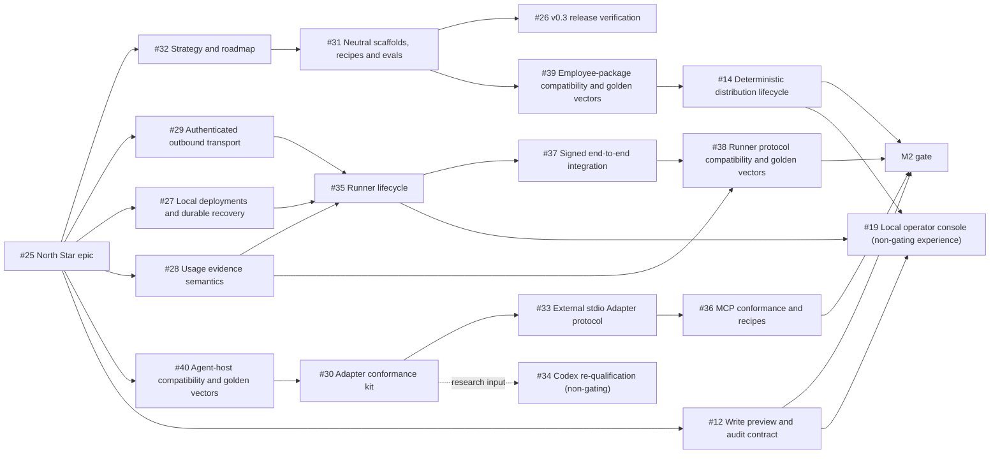

# Digital Employee roadmap

[简体中文](roadmap.zh-CN.md)

This roadmap turns the stable [product strategy](strategy.md) into an
executable issue graph. [Epic #25](https://github.com/fullstack-ai-infra/digital-employee/issues/25)
is the delivery index. Issue labels and milestones are the source of truth for
current status; this document defines sequence, ownership and acceptance gates,
not delivery dates or full issue specifications.

## Shipped baseline

| Area | Evidence in the current source | Maturity and remaining boundary |
| --- | --- | --- |
| Agent-native authoring | Host-neutral `init`, package-aware `validate`, and bounded `doctor` commands | **shipped** in source; neutral recipes and executable evals are M0 work |
| Local Agent Host execution | Version-gated one-shot paths for Qoder CLI, Claude Code, Qwen Code and CodeBuddy Code | **preview** and **fixture-conformant**; live entitlement is not proven |
| Codex | Discovery and readiness diagnosis | **probe-only**; it is not a runnable Adapter |
| Runner kernel | Package digest and sealed snapshot, signed task/lease verification, replay port, hash-chained events and signed receipt for one task | **preview** embeddable kernel; no long-running Runner or public network SDK is shipped |
| Compatibility runtime | `standalone-v1` answer-agent runtime and connectors | **shipped** compatibility path; not the target for new general Agent capabilities |

All application/service employees execute on a publisher- or operator-owned
computer or server. The target long-running seller Runner is public framework
work, but it is not delivered by the current one-shot preview.

## Delivery graph

The normative ordering is:

- M0: [#32](https://github.com/fullstack-ai-infra/digital-employee/issues/32)
  → [#31](https://github.com/fullstack-ai-infra/digital-employee/issues/31)
  → [#26](https://github.com/fullstack-ai-infra/digital-employee/issues/26).
- M1: [#29](https://github.com/fullstack-ai-infra/digital-employee/issues/29)
  + [#27](https://github.com/fullstack-ai-infra/digital-employee/issues/27)
  + [#28](https://github.com/fullstack-ai-infra/digital-employee/issues/28)
  → [#35](https://github.com/fullstack-ai-infra/digital-employee/issues/35)
  → [#37](https://github.com/fullstack-ai-infra/digital-employee/issues/37).
  Parts of #35 may be implemented while its inputs are being designed, but the
  gate closes only in this order.
- M2 package/distribution chain:
  #31 → [#39](https://github.com/fullstack-ai-infra/digital-employee/issues/39)
  → [#14](https://github.com/fullstack-ai-infra/digital-employee/issues/14)
  → M2 gate.
- M2 Host/capability chain:
  [#40](https://github.com/fullstack-ai-infra/digital-employee/issues/40)
  → [#30](https://github.com/fullstack-ai-infra/digital-employee/issues/30)
  → [#33](https://github.com/fullstack-ai-infra/digital-employee/issues/33)
  → [#36](https://github.com/fullstack-ai-infra/digital-employee/issues/36)
  → M2 gate.
  [#34](https://github.com/fullstack-ai-infra/digital-employee/issues/34) is a
  non-gating research watchlist item informed by #30, not a condition for M2
  closure.
- M2 Runner protocol stability chain:
  [#28](https://github.com/fullstack-ai-infra/digital-employee/issues/28)
  + [#37](https://github.com/fullstack-ai-infra/digital-employee/issues/37)
  → [#38](https://github.com/fullstack-ai-infra/digital-employee/issues/38)
  → M2 gate.
- M2 write-trust gate:
  [#12](https://github.com/fullstack-ai-infra/digital-employee/issues/12)
  → M2 gate.
- Non-gating experience track:
  #12 + #14 + #35
  → [#19](https://github.com/fullstack-ai-infra/digital-employee/issues/19).
  #19 consumes stable public contracts but does not gate M0, M1, M2 or a
  framework release.

## M0 — Builder Ready

**User outcome:** an author can install the Agent-native framework, create a
host-neutral employee that is not forced into the answer-agent shape, validate
and evaluate it, and complete a documented local run.

| Story | Deliverable | Dependency | Team |
| --- | --- | --- | --- |
| [#32](https://github.com/fullstack-ai-infra/digital-employee/issues/32) | Make strategy and roadmap the repository source of truth | Epic #25 | Product architecture |
| [#31](https://github.com/fullstack-ai-infra/digital-employee/issues/31) | Add neutral scaffolds, checked-in recipes and executable evals | #32 | Builder experience |
| [#26](https://github.com/fullstack-ai-infra/digital-employee/issues/26) | Publish and independently verify v0.3 artifacts | #31 | Release engineering |

**Gate:** a clean-machine quickstart is repeatable; at least two materially
different employees use the same contracts; evals execute; failures are
actionable and fail closed; support claims use the strategy's evidence
vocabulary; published artifacts are independently verified.

**Known blocker:** #26 currently invokes `npm --prefix packages/core pack
--dry-run`, which erroneously verifies the root package instead of the core
package. The release gate cannot close until the intended artifact is packed
and independently inspected.

## M1 — Seller Runner Ready

**User outcome:** a seller can keep an employee online on a machine they
control and accept authentic platform work without an inbound port, package
upload or disclosure of the Agent Host credential.

| Story | Deliverable | Dependency | Team |
| --- | --- | --- | --- |
| [#29](https://github.com/fullstack-ai-infra/digital-employee/issues/29) | Authenticated outbound transport and device-key rotation contract | Epic #25 | Runner protocol |
| [#27](https://github.com/fullstack-ai-infra/digital-employee/issues/27) | Local deployment registry, durable replay/outbox and crash recovery | Epic #25 | Runner reliability |
| [#28](https://github.com/fullstack-ai-infra/digital-employee/issues/28) | Provider-neutral usage evidence semantics | Epic #25 | Protocol and trust |
| [#35](https://github.com/fullstack-ai-infra/digital-employee/issues/35) | `runner init/doctor/start/status` lifecycle | #29 + #27 + #28 | Runner lifecycle |
| [#37](https://github.com/fullstack-ai-infra/digital-employee/issues/37) | Signed task → local Runner → Host → signed receipt integration proof | #35 | Integration and security |

**Gate:** the public Runner lifecycle and local bindings survive restart and
network interruption; replayed or stale attempts fail before launch; a
committed mock-control-plane test covers claim through receipt; observable
evidence proves that local paths, package bytes and Host credentials never
reach the control plane.

## M2 — Framework v1 / Trust Ready

**User outcome:** builders and integrators can independently validate and
interoperate with employee packages, Agent Hosts and Runner protocols through
versioned, language-neutral compatibility contracts, while distribution and
side effects retain explicit verification and fail-closed trust boundaries.

| Story | Deliverable | Dependency | Team |
| --- | --- | --- | --- |
| [#39](https://github.com/fullstack-ai-infra/digital-employee/issues/39) | Stabilize employee-package compatibility and language-neutral golden vectors | #31 | Builder and distribution |
| [#14](https://github.com/fullstack-ai-infra/digital-employee/issues/14) | Deterministic archive, verify/install/rollback lifecycle | #39 | Distribution |
| [#40](https://github.com/fullstack-ai-infra/digital-employee/issues/40) | Stabilize agent-host compatibility and language-neutral golden vectors | Shipped Agent Host baseline | Host qualification |
| [#30](https://github.com/fullstack-ai-infra/digital-employee/issues/30) | Reusable Adapter conformance and qualification kit | #40 | Host qualification |
| [#33](https://github.com/fullstack-ai-infra/digital-employee/issues/33) | External stdio Agent Host Adapter protocol and SDK | #30 | Host extensibility |
| [#36](https://github.com/fullstack-ai-infra/digital-employee/issues/36) | MCP conformance and synthetic memory/document recipes | #33 | Capability ecosystem |
| [#38](https://github.com/fullstack-ai-infra/digital-employee/issues/38) | Stabilize Runner protocol compatibility and language-neutral golden vectors | #28 + #37 | Runner protocol |
| [#12](https://github.com/fullstack-ai-infra/digital-employee/issues/12) | Write preview, approval, idempotency and audit contract | Epic #25 | Tool safety |

**Gate:** employee-package, Agent Host and Runner contracts each have
language-neutral golden vectors, version negotiation, unknown-field behavior
and deterministic migration rules; archive inspection and rollback reject
tampering without executing package code; one external sample Adapter passes
the conformance kit without a core dispatch change; usage evidence remains
separate from Quote/Credit math; write capabilities are default-deny and
satisfy #12.

### Non-gating experience track

| Story | Experience outcome | Prerequisites | Team |
| --- | --- | --- | --- |
| [#19](https://github.com/fullstack-ai-infra/digital-employee/issues/19) | Optional local operator console over stable public framework APIs | #12 + #14 + #35 | Local operator UX |

#19 belongs to the `Experience — Local Operator UX` milestone. It may begin
after its inputs stabilize, but its absence cannot block M0, M1, M2 or a
framework release.

### Non-gating research watchlist

| Story | Research question | Revisit when | Team |
| --- | --- | --- | --- |
| [#34](https://github.com/fullstack-ai-infra/digital-employee/issues/34) | Can Codex satisfy the default-deny runnable Adapter contract? | #30 is reusable and upstream exposes an enforceable tool boundary | Host qualification |

#34 can improve Host coverage, but it is not required to close M2 and must not
weaken the qualification gate for any other Host.

## Team ownership

| Team | Accountable issues | Boundary |
| --- | --- | --- |
| Product architecture | #25, #32 | North Star, scope, dependency graph and evidence language |
| Builder, distribution and release | #31, #26, #39, #14 | Author workflow, recipes/evals, package compatibility, artifacts and distribution lifecycle |
| Runner and protocol | #29, #27, #28, #35, #37, #38 | Seller-machine client, durability, public transport, end-to-end proof and protocol compatibility |
| Host qualification | #40, #30, #33, #34 | Agent-host compatibility, Adapter evidence, external protocol and host admission |
| Capability and tool trust | #36, #12 | MCP/recipe conformance and safe side effects |
| Local operator UX | #19 | Optional local console consuming public APIs after Runner, write-trust and distribution contracts |

## Blockers and decision points

- #26 is blocked by the core-package dry-run defect described above.
- #35 cannot close until #29, #27 and #28 are accepted; parallel code does not
  waive those contracts. #37 then proves the combined path.
- #39 waits for #31; #14 then consumes its stable package compatibility line.
- #40 must establish Agent Host compatibility before #30, #33 and #36 can
  close in sequence.
- #38 waits for #28 and #37; its compatibility and golden-vector evidence is a
  required M2 gate.
- #12 is an independent required M2 gate.
- #19 waits for #12, #14 and #35 as a non-gating experience consumer; it cannot
  delay a milestone or framework release.

## Private control-plane backlog

The following work is intentionally **private** and must be tracked outside
this repository: marketplace accounts, listings, discovery, ratings and rental;
server-side device registration and credential issuance; production task and
lease scheduling; event ingestion and independent `UsageVerifier`; immutable
Quote creation, Credit ledger, pricing, billing, refunds, payout, tax and
settlement; marketplace UI and operator administration.

Only interoperable client and protocol contracts required by the public Runner
belong here. A private service must never receive package bytes, local paths or
Host credentials, and must never execute the employee.

## Maintaining this roadmap

- Change an issue's labels or milestone to change status; then update this
  snapshot when its dependency or gate effect changes.
- Record implementation proof in the verification ledger and linked PRs. Do
  not turn this roadmap into duplicate issue bodies.
- Add cross-cutting milestone work with the roadmap-item issue form. A product
  name alone is not an Agent support requirement; specify the user outcome,
  enforceable capability boundary, version range and observable evidence.
- Do not add calendar promises here. Sequence follows gates and dependency
  evidence.
