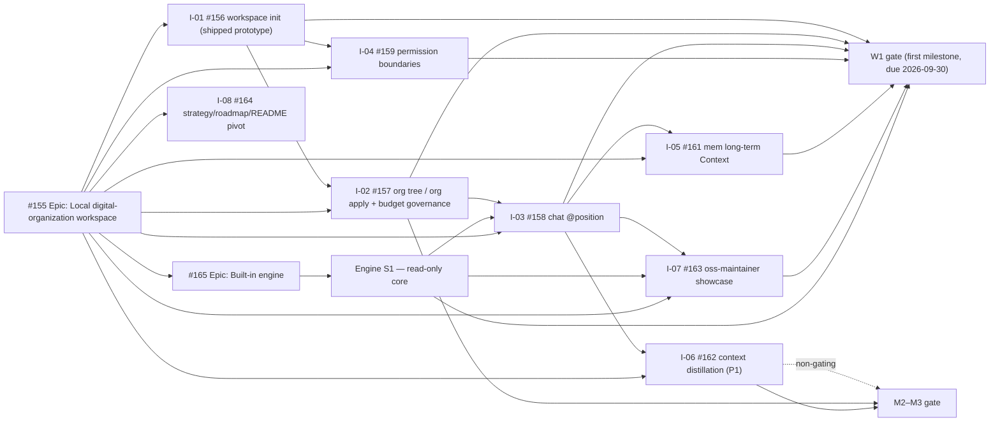

# Digital Employee roadmap

[简体中文](roadmap.zh-CN.md)

This roadmap turns the stable [product strategy](strategy.md) into an
executable issue graph. [Epic #155](https://github.com/fullstack-ai-infra/digital-employee/issues/155)
(Local digital-organization workspace) is the delivery index for the new
mainline; [Epic #25](https://github.com/fullstack-ai-infra/digital-employee/issues/25)
stays open only as the old-track wrap-up index. Issue labels and milestones are
the source of truth for current status; this document defines sequence,
ownership and acceptance gates, not delivery dates or full issue
specifications.

## Shipped baseline

| Area | Evidence in current source and public release | Maturity and remaining boundary |
| --- | --- | --- |
| Employee-package authoring | Host-neutral `init`, package-aware `validate`, bounded `doctor`, the `minimal-answer.v1` and `structured-action.v1` recipes, and executable offline contract evals | **shipped** in current public `0.6.0` (initial public baseline `0.4.0`); fixture eval does not prove live model entitlement |
| Workspace skeleton | `workspace init --template oss-maintainer` materializes the organization file, four position packages and the context directory (#156) | **released preview** in current `0.6.0` (first published in `0.5.0`) |
| Organization and permissions | `org tree`, `org apply`, `org scope`, derived permission artifacts, and fail-closed engine enforcement | **released preview**; organization commands first published in `0.5.0`, engine enforcement added in `0.6.0` |
| Built-in turn engine | Installed root-package `./engine` export and `turn run` CLI | **released preview** in current `0.6.0` (first published in `0.5.0`); the complete default-Host Workbench path is not shipped |
| Explicit single-hop delegation | One owner-to-direct-report `task delegate` route with intersection-only scope | **released preview / deterministic E3** in current `0.6.0` (first published in `0.5.0`); no general graph, Workbench persistence/UI, or per-Host E4 claim |
| Memory and Context engine seams | Opt-in scope-bound `MemoryPort` and read-only `ContextPort` wiring | **released preview** in `0.6.0`; productive long-term memory, Workbench continuity, and context distillation remain unshipped |
| Local Agent Host execution | Version-gated one-shot paths for Qoder CLI, Claude Code, Qwen Code and CodeBuddy Code | **preview** and **fixture-conformant**; live entitlement is not proven |
| Codex | Discovery and readiness diagnosis | **probe-only**; it is not a runnable Adapter |
| Runner kernel | Package digest and sealed snapshot, signed task/lease verification, replay port, hash-chained events and signed receipt for one task | **preview** embeddable kernel; no long-running Runner or public network SDK is shipped |
| Compatibility runtime | `standalone-v1` answer-agent runtime and connectors | **shipped** compatibility path; not the target for new mainline capabilities |
| Deploy command | Package-bound `deploy` with truthful local outcome and fail-closed recovery | **preview** surface; HTTP can reach `ready`; DingTalk reconciliation is externally HOLD |

The `workspace init`, `org tree`, and `org apply` prototypes are released
previews in current public `0.6.0` (first published in `0.5.0`).
`chat @position` and the durable Workbench journey remain owned by the new
mainline below. The built-in engine Epic
([#165](https://github.com/fullstack-ai-infra/digital-employee/issues/165))
keeps its remaining unreleased slices and acceptance gates separate.

## Delivery graph (new mainline)

The normative ordering is:

- **W1 (first milestone, due 2026-09-30, marked):**
  [#156](https://github.com/fullstack-ai-infra/digital-employee/issues/156)
  → [#157](https://github.com/fullstack-ai-infra/digital-employee/issues/157)
  → [#158](https://github.com/fullstack-ai-infra/digital-employee/issues/158),
  with [#159](https://github.com/fullstack-ai-infra/digital-employee/issues/159)
  and [#161](https://github.com/fullstack-ai-infra/digital-employee/issues/161)
  closing the permission and memory loop, and
  [#163](https://github.com/fullstack-ai-infra/digital-employee/issues/163)
  proving the oss-maintainer showcase end to end. Engine S1
  ([#165](https://github.com/fullstack-ai-infra/digital-employee/issues/165))
  underpins chat turn execution and showcase acceptance; it aligns with
  I-01..I-07 on this milestone.
- [#162](https://github.com/fullstack-ai-infra/digital-employee/issues/162)
  (context distillation) is P1 and non-gating for W1.
- [#164](https://github.com/fullstack-ai-infra/digital-employee/issues/164)
  (this pivot) is parallel and does not block W1.
- **M2–M3:** context distillation depth, `org apply` lifecycle and productive
  mem-backed recall become the next gate, together with the engine S2 harness
  layer (#165). Channel output rendering
  ([#160](https://github.com/fullstack-ai-infra/digital-employee/issues/160))
  is owned outside this pivot and is not scheduled here.
- **M4+:** engine S3 graph layer (cross-position routing and delegation
  orchestration, #165). Planned.

## W1 — Workspace closed loop (first milestone, due 2026-09-30)

**User outcome:** a user turns one business directory into a directly
addressable AI team with long-term Context and permission boundaries, and
reproduces the first showcase case (oss-maintainer) end to end
(#155 EPIC-AC-001).

| Story | Deliverable | Dependency | Team |
| --- | --- | --- | --- |
| [#156](https://github.com/fullstack-ai-infra/digital-employee/issues/156) | `workspace init` prototype with oss-maintainer template (released preview in `0.6.0`) | Epic #155 | Workspace |
| [#157](https://github.com/fullstack-ai-infra/digital-employee/issues/157) | Organization model with `org tree` / `org apply`, directory-tree semantics and position budget governance | #156 | Org model |
| [#158](https://github.com/fullstack-ai-infra/digital-employee/issues/158) | `chat @position` conversation bridge (turn contract) | #102, #156 | Chat bridge |
| [#159](https://github.com/fullstack-ai-infra/digital-employee/issues/159) | Position permission boundaries (Context Scope + Authority Scope) | #156 | Governance |
| [#161](https://github.com/fullstack-ai-infra/digital-employee/issues/161) | Long-term Context integration (mem R1-level; recall seam in W1, mem-backed recall M2) | #158, mem #68 | Memory |
| [#163](https://github.com/fullstack-ai-infra/digital-employee/issues/163) | oss-maintainer showcase (quickstart form) | #156, #158 | Adoption |
| [#162](https://github.com/fullstack-ai-infra/digital-employee/issues/162) | Context fact distillation integration (rule-based; P1, non-gating for W1) | #158, context | Context |
| [#165](https://github.com/fullstack-ai-infra/digital-employee/issues/165) | Built-in engine S1 read-only core: turn execution, context assembly, loop control, structural fail-closed, per-turn evidence | #102 groundwork | Engine |

**Gate:** clean-machine `workspace init` → `org tree` → `chat @position`
(owner and worker paths); Context slices are narrow and permission
boundaries hold; decisions persist to `mem` and a new session recalls them;
`org apply` preserves Context and recomputes permissions, and a hire without
an allocated budget fails closed; the showcase is reproducible from the
quickstart; the four showcase packages run end to end on the built-in engine
with zero external host and zero credentials, a forced budget or doom-loop
termination is demonstrated, and every showcase turn carries an evidence
record under the #140 standard (#165 AC-001..AC-004); every claim uses the
evidence vocabulary.

**Non-goals:** channels (CLI-only), marketplace/transaction work, full RBAC,
Host-native session resume, and any weakening of the S1 structural
guarantees.

## M2–M3 — Context depth, org lifecycle and engine harness

**User outcome:** the workspace keeps learning: session text is distilled into
a rule-based entity graph, `org apply` becomes the trusted way to change the
organization, and the engine grows a harness layer above the read-only core.

| Story | Deliverable | Dependency | Team |
| --- | --- | --- | --- |
| [#162](https://github.com/fullstack-ai-infra/digital-employee/issues/162) | Rule-based context distillation drives narrow-slice recall | #158, context | Context |
| [#157](https://github.com/fullstack-ai-infra/digital-employee/issues/157) | `org apply` audits organizational changes | #156 | Org model |
| [#161](https://github.com/fullstack-ai-infra/digital-employee/issues/161) | Mem-backed recall in productive use | #158, mem | Memory |
| [#165](https://github.com/fullstack-ai-infra/digital-employee/issues/165) | Engine S2 harness layer: tool dispatch, MCP client, approval gates, sandboxing, runtime enforcement of position permission boundaries (extends the S1 zero-tool baseline, never weakens it) | S1 | Engine |

**Non-goals:** channel expansion (Lark/WeCom), marketplace/transaction work,
and full RBAC.

## D5 backlog — Codex-aligned session and approval semantics (not scheduled)

Backlog registered per CEO directive (2026-08-25); codex is the reference
baseline. Both items hang on the org-workbench session lifecycle delivered by
[org-workbench#14](https://github.com/fullstack-ai-infra/org-workbench/pull/14)
(canonical [#12](https://github.com/fullstack-ai-infra/org-workbench/issues/12)).
Non-gating for W1 and M2–M3; no gate date until scheduled.

| Item | Deliverable | Dependency | Team |
| --- | --- | --- | --- |
| [D5-B1 #186](https://github.com/fullstack-ai-infra/digital-employee/issues/186) | Rollout-style session resume/fork semantics (codex-rollout aligned) | org-workbench#14 | Workbench/Session |
| [D5-B2 #187](https://github.com/fullstack-ai-infra/digital-employee/issues/187) | In-turn approval interaction product semantics (when to prompt, default policy, denial terminal state), coupled with engine `approval.*` vocabulary | #165 engine, write-approval.v1 | Product/Engine |
## M4+ — Engine graph layer

The engine S3 graph layer provides cross-position routing, parallelism and
delegation orchestration over the organization model, with permission checks
at every hop (#165). Planned; scope binds only after M2–M3 closes.

## Old-track wrap-up and issue disposition

The old mainline (**Builder → Seller Runner → Trusted execution**, epic #25)
is finished and is not extended. Every open old-track issue carries an
explicit **KEEP / REPURPOSE / PARK** disposition per the approved
[#164](https://github.com/fullstack-ai-infra/digital-employee/issues/164)
ledger (2026-08-23): **KEEP 11 / REPURPOSE 9 / PARK 5**. KEEP joins the new
mainline; REPURPOSE is re-scoped as design input for the workspace/engine
lines; PARK is closed as not planned with an explicit revival condition. The
ledger is already executed (see execution status below). Dispositions are
recorded, not destructive: issues are not mass-rewritten, and no issue is
silently dropped.

### New mainline (Epic #155 and its sub-issues)

| Issue | Title | Disposition |
| --- | --- | --- |
| [#155](https://github.com/fullstack-ai-infra/digital-employee/issues/155) | [Epic] Local digital-organization workspace | **KEEP** — new mainline delivery index; supersedes #25 as North Star |
| [#156](https://github.com/fullstack-ai-infra/digital-employee/issues/156) | feat(workspace): `workspace init` prototype | **KEEP** — W1 (released preview in `0.6.0`) |
| [#157](https://github.com/fullstack-ai-infra/digital-employee/issues/157) | feat(org): organization model, `org tree` / `org apply` | **KEEP** — W1 |
| [#158](https://github.com/fullstack-ai-infra/digital-employee/issues/158) | feat(chat): `chat @position` conversation bridge | **KEEP** — W1 |
| [#159](https://github.com/fullstack-ai-infra/digital-employee/issues/159) | feat(org): position permission boundaries | **KEEP** — W1 |
| [#161](https://github.com/fullstack-ai-infra/digital-employee/issues/161) | feat(mem): long-term Context integration (R1-level) | **KEEP** — W1 recall seam; M2 mem-backed recall |
| [#162](https://github.com/fullstack-ai-infra/digital-employee/issues/162) | feat(context): fact distillation integration (rule-based) | **KEEP** — M2–M3 (P1) |
| [#163](https://github.com/fullstack-ai-infra/digital-employee/issues/163) | showcase: oss-maintainer case (quickstart form) | **KEEP** — W1 |
| [#164](https://github.com/fullstack-ai-infra/digital-employee/issues/164) | docs(strategy): pivot strategy/roadmap/README | **KEEP** — this pivot; parallel, non-blocking |
| [#165](https://github.com/fullstack-ai-infra/digital-employee/issues/165) | feat(engine): built-in execution engine Epic | **KEEP** — engine mainline; S1 aligned with W1 |

> Not part of this pivot: [#160](https://github.com/fullstack-ai-infra/digital-employee/issues/160)
> (UX: channel output rendering) is owned outside Epic #155 and is intentionally
> left untouched here. It is noted only so that no open issue is silently dropped
> from this accounting; this roadmap assigns it no disposition or milestone.

### Old-track issues — KEEP (11, no action)

| Issue | Content | Rationale |
| --- | --- | --- |
| [#25](https://github.com/fullstack-ai-infra/digital-employee/issues/25) | Old North Star epic | Retained as the old-track wrap-up vehicle; carries the disposition ledger wording (#155) |
| [#70](https://github.com/fullstack-ai-infra/digital-employee/issues/70) | Honest local deployment orchestration | Workspace init/deployment foundation (honest deployment + secret-safety state) |
| [#86](https://github.com/fullstack-ai-infra/digital-employee/issues/86) | Deployment help and automation flags | CLI experience layer for the workspace command family |
| [#90](https://github.com/fullstack-ai-infra/digital-employee/issues/90) | Deployment binding with exact employee package + explicit runtime | Built-in engine = explicit runtime binding makes this constraint more critical |
| [#91](https://github.com/fullstack-ai-infra/digital-employee/issues/91) | [Epic] Adoption | Re-anchored: the clean-machine acceptance target becomes the #163 oss-maintainer showcase |
| [#95](https://github.com/fullstack-ai-infra/digital-employee/issues/95) | Governance enforcement | Repository-level requirement governance; depended on by all tracks |
| [#97](https://github.com/fullstack-ai-infra/digital-employee/issues/97) | Remove the single-reviewer bottleneck | Governance hygiene |
| [#136](https://github.com/fullstack-ai-infra/digital-employee/issues/136) | Versioned release gate | Portability proof gate + precondition for the quickstart pinned version |
| [#139](https://github.com/fullstack-ai-infra/digital-employee/issues/139) | External deployment experience design | Adoption-line UX |
| [#141](https://github.com/fullstack-ai-infra/digital-employee/issues/141) | Clean-machine install notes | Adoption-line evidence |
| [#144](https://github.com/fullstack-ai-infra/digital-employee/issues/144) | Scenario pipeline and value acceptance ownership | Product-track function retained; SKU ordering re-sequenced per ruling |

### Old-track issues — REPURPOSE (9, disposition comment recorded, kept open)

| Issue | Content | Redirected to | Disposition comment |
| --- | --- | --- | --- |
| [#102](https://github.com/fullstack-ai-infra/digital-employee/issues/102) | Turn contract RFC | Direct design input for engine Epic #165 S1 turn execution and the I-03 chat bridge (#158) | [comment](https://github.com/fullstack-ai-infra/digital-employee/issues/102#issuecomment-5384895954) |
| [#104](https://github.com/fullstack-ai-infra/digital-employee/issues/104) | Audit evidence retention/recovery RFC | Merged into the engine per-turn evidence recording and long-term Context retention design (#165 evidence line + #161) | [comment](https://github.com/fullstack-ai-infra/digital-employee/issues/104#issuecomment-5384896299) |
| [#137](https://github.com/fullstack-ai-infra/digital-employee/issues/137) | Runner security audit | Audit target re-focused: built-in engine + deployment state; owned by the engine line (#165) | [comment](https://github.com/fullstack-ai-infra/digital-employee/issues/137#issuecomment-5384896696) |
| [#142](https://github.com/fullstack-ai-infra/digital-employee/issues/142) | Three reproducible showcases | First slot merged into #163 (oss-maintainer); later slots follow the SKU order | [comment](https://github.com/fullstack-ai-infra/digital-employee/issues/142#issuecomment-5384896959) |
| [#34](https://github.com/fullstack-ai-infra/digital-employee/issues/34) | Codex CLI adapter re-qualification | Moved into the engine Epic "external Agent Host adapter option" workflow (after S1) | [comment](https://github.com/fullstack-ai-infra/digital-employee/issues/34#issuecomment-5384897265) |
| [#46](https://github.com/fullstack-ai-infra/digital-employee/issues/46) | agent-host.v1 corpus | Retained as the conformance test corpus for the external adapter option | [comment](https://github.com/fullstack-ai-infra/digital-employee/issues/46#issuecomment-5384897549) |
| [#52](https://github.com/fullstack-ai-infra/digital-employee/issues/52) | Qualification evidence authenticity | Authenticity requirements merged into the engine per-turn evidence line and the adapter qualification line | [comment](https://github.com/fullstack-ai-infra/digital-employee/issues/52#issuecomment-5384897896) |
| [#113](https://github.com/fullstack-ai-infra/digital-employee/issues/113) | Qoder structured_output qualification | Adapter-option backlog (not on the first-milestone path) | [comment](https://github.com/fullstack-ai-infra/digital-employee/issues/113#issuecomment-5384898219) |
| [#125](https://github.com/fullstack-ai-infra/digital-employee/issues/125) | claude-stream normalization tests | Adapter-option test asset (credential gate unchanged) | [comment](https://github.com/fullstack-ai-infra/digital-employee/issues/125#issuecomment-5384898517) |

### Old-track issues — PARK (5, closed as not planned)

| Issue | Content | PARK rationale | Revival condition | Disposition comment |
| --- | --- | --- | --- | --- |
| [#19](https://github.com/fullstack-ai-infra/digital-employee/issues/19) | External control-plane adapter RFC | The new mainline is the local workspace; this milestone has no independent operator-surface requirement | Re-propose when the workspace needs an independent operator surface | [comment](https://github.com/fullstack-ai-infra/digital-employee/issues/19#issuecomment-5384891868) |
| [#55](https://github.com/fullstack-ai-infra/digital-employee/issues/55) | Host Phase A hardening (blocked) | External Host route; not on the M1–M3 path | When the external Host route is revived | [comment](https://github.com/fullstack-ai-infra/digital-employee/issues/55#issuecomment-5384892534) |
| [#77](https://github.com/fullstack-ai-infra/digital-employee/issues/77) | Lark channel | No channel expansion in the first milestone (consistent with the #155 non-goal) | Second-SKU kickoff or a channel-expansion milestone | [comment](https://github.com/fullstack-ai-infra/digital-employee/issues/77#issuecomment-5384893954) |
| [#78](https://github.com/fullstack-ai-infra/digital-employee/issues/78) | WeCom channel | No channel expansion in the first milestone (consistent with the #155 non-goal) | Second-SKU kickoff or a channel-expansion milestone | [comment](https://github.com/fullstack-ai-infra/digital-employee/issues/78#issuecomment-5384894645) |
| [#138](https://github.com/fullstack-ai-infra/digital-employee/issues/138) | Real-device and credential provisioning | All three consumers (#125/#77/#78) have left the first-milestone path | Re-evaluate when the consumers are revived (adapter-option workflow) | [comment](https://github.com/fullstack-ai-infra/digital-employee/issues/138#issuecomment-5384895373) |

### M1 draft dispositions (record only)

Four drafts were never created as issues; their dispositions are recorded for
completeness.

| Draft | Disposition | Destination |
| --- | --- | --- |
| D1 gold-standard question set freeze | REPURPOSE | Methodology retained as the eval baseline for the second SKU (knowledge Q&A); draft archived |
| D2 knowledge-pack toolchain | REPURPOSE | The pack→verify→redistribute pattern becomes design input for the I-05 (#161) / I-06 (#162) Context asset pipeline |
| D3 DingTalk pilot onboarding | PARK | Revive with the second SKU (knowledge Q&A) kickoff |
| D4 platform metering and settlement | PARK | #155 non-goal; platform work parked entirely as phase-two reserve |

### Cross-repository summary (record only; no action was taken outside digital-employee)

- **digital-employee-platform**: #2/#5/#8 all PARK (phase-two reserve); the
  #5/#8 HOLD marks stay untouched.
- **doc**: maintenance mode — repair-level actions only; documentation changes
  go through separate small PRs.
- **mem**: KEEP core — #68 (R1–R2) is a declared dependency of #155; the
  identity cluster (#65/#74–77) stays blocked and unscheduled; #103
  (conversation transcript ingestion) is redirected as design input for the
  I-06 (#162) distillation pipeline.
- **.github**: #6 vision RFC KEEP (references updated with this pivot); #7 O1
  cross-plane proof REPURPOSE — the proof obligation is carried by the
  workspace closed loop + the #163 showcase; #8 governance KEEP.
- **digital-employee-quickstart**: #1 four-employee matrix REPURPOSE as the
  oss-maintainer showcase slot; #2 pinned deployment path KEEP (with #136).

### Execution status

PARK 5 were closed as not planned (#19, #55, #77, #78, #138); REPURPOSE 9 were
commented and kept open (#102, #104, #137, #142, #34, #46, #52, #113, #125);
KEEP 11 were left untouched. No repository other than digital-employee was
modified; the platform #5/#8 HOLD marks were not touched.

## Blockers and decision points

- #158 (`chat @position`) waits for the #102 turn contract to be approved;
  the chat bridge must reuse it, not invent a second conversation model.
- #165 engine S1 consumes the same #102 turn-contract groundwork and binds to
  the W1 gate through the #163 showcase; engine packaging, the engine/Host
  relationship and the evidence schema remain open decisions recorded in #165.
- #161 waits for #158 plus the mem R1-level memory plane
  (mem #68); position-agent token identity (mem #74) may fall back to a
  temporary token for the first milestone, recorded explicitly in #161.
- #163 waits for #156 and #158; the showcase is the end-to-end acceptance
  artifact for W1.
- The old-track wrap-up is already executed per the ledger above; it never
  blocks W1 or M2–M3.

## Team ownership

| Team | Accountable issues | Boundary |
| --- | --- | --- |
| Product | #155, #164, #144 | North Star, scope, dependency graph, evidence language and roadmap ordering |
| Workspace | #156, #157, #159 | Workspace init, organization model, permission boundaries |
| Chat and memory | #158, #161, #162 | Turn bridge, long-term Context, context distillation |
| Engine | #165 | Built-in engine capability model and slices (technical owner unassigned) |
| Adoption | #163, #91, #141, #142 | Showcase, clean-machine walkthrough and adoption content |
| Repo governance | #95, #97 | Requirement/acceptance ledgers and review-bottleneck removal |

Delivery and review ownership is recorded per canonical Issue revision as
`implementationOwner`, `automatedPreReviewOwner`, and `humanReviewOwner`.
Product/P9 owns the Issue contract and dependency DAG; P8 owns implementation,
tests, CI, fixes, and the evidence packet; an independent automated reviewer
may issue only `PREFLIGHT PASS` or findings. Totoro (`@Bindy-lbb`) is routed
only when an Issue or CODEOWNERS explicitly assigns her a stable high-risk,
cross-repository, or public-contract candidate. She does not implement and
finally review the same candidate, and is not repeatedly requested during
development. `org-workbench` and `context` default to `humanReviewOwner: none`
unless their canonical Issue explicitly names a human reviewer.

## Private work (stays inside the company)

Marketplace accounts, listings, discovery, ratings, rental, dynamic pricing,
Quote, Credit, billing, settlement, and any company-internal transaction stay
private and are tracked outside this repository. The open repository never
implements them. Channel expansion (Lark/WeCom) is out of scope for the first
milestone.

## Maintaining this roadmap

- Change an issue's labels or milestone to change status; then update this
  snapshot when its dependency or gate effect changes.
- Record implementation proof in the verification ledger and linked PRs. Do
  not turn this roadmap into duplicate issue bodies.
- Add cross-cutting milestone work with the roadmap-item issue form. A product
  name alone is not an Agent support requirement; specify the user outcome,
  enforceable capability boundary, version range and observable evidence.
- Do not add calendar promises here beyond milestone due dates already fixed by
  recorded decisions. Sequence follows gates and dependency evidence.
- Keep the disposition ledger in sync with the approved #164 record; a
  disposition change requires an explicit decision in the canonical issue and
  is updated here in the same PR. Never use this table to silently close an
  issue.
