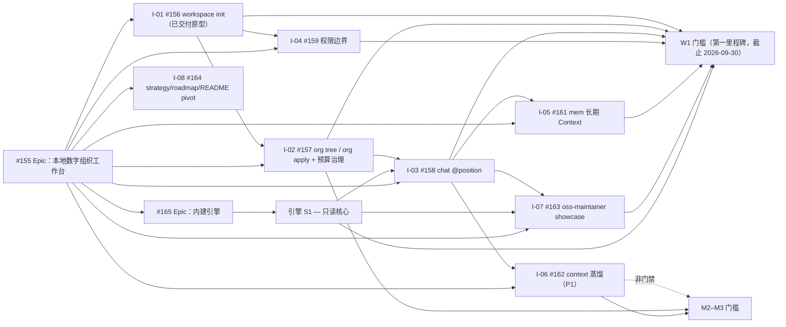

# Digital Employee 路线图

[English](roadmap.md)

本路线图把稳定的[产品策略](strategy.zh-CN.md)转化为可执行的 Issue 依赖图。
[Epic #155](https://github.com/fullstack-ai-infra/digital-employee/issues/155)
（本地数字组织工作台）是新主线的交付索引；
[Epic #25](https://github.com/fullstack-ai-infra/digital-employee/issues/25)
仅作为旧轨收尾索引保留。Issue label 和 milestone 是当前状态的事实来源；本文定义
顺序、归属和验收门槛，不承诺日期，也不复制完整 Issue 规格。

## 已交付基线

| 领域 | 当前源码中的证据 | 成熟度与剩余边界 |
| --- | --- | --- |
| 员工包开发 | 宿主中立的 `init`、理解员工包的 `validate`、有上限的 `doctor`、`minimal-answer.v1` 与 `structured-action.v1` recipe，以及可执行的离线契约 eval | 当前源码与公开 `0.4.0` 制品中已 **shipped**；fixture eval 不代表真实模型权益已验证 |
| 工作区骨架 | `workspace init --template oss-maintainer` 生成组织文件、四个岗位包和 context 目录（#156） | `0.4.0` 之后的当前源码中以原型形式 **shipped**；不属于已发布 `0.4.0` 制品 |
| 本机 Agent Host 执行 | 对 Qoder CLI、Claude Code、Qwen Code、CodeBuddy Code 提供版本锁定的 one-shot 路径 | **preview** 且 **fixture-conformant**；尚未证明真实模型权益 |
| Codex | 发现与 readiness 诊断 | **probe-only**；不是可运行 Adapter |
| Runner 内核 | 单任务的包摘要与密封快照、签名任务/租约校验、replay 端口、hash-chain 事件和签名回执 | 可嵌入的 **preview** 内核；未交付长期 Runner 或公开网络 SDK |
| 兼容运行时 | `standalone-v1` 答疑员工运行时与 connectors | 已 **shipped** 的兼容路径；不是新主线能力的目标路径 |
| 部署命令 | 绑定员工包的 `deploy`，诚实的本地结果与失败关闭恢复 | **preview** 能力面；HTTP 可到 `ready`；钉钉对账处于外部 HOLD |

`workspace init`、`org tree` 与 `org apply` 原型已在 `0.4.0` 之后的当前源码交付。
`chat @position` 与持久化 Workbench 旅程仍由下方新主线推进。内建引擎 Epic
（[#165](https://github.com/fullstack-ai-infra/digital-employee/issues/165)）
继续分别管理尚未发布的切片与验收门禁。

## 交付依赖图（新主线）

规范交付顺序是：

- **W1（第一里程碑，截止 2026-09-30，已标记）：**
  [#156](https://github.com/fullstack-ai-infra/digital-employee/issues/156)
  → [#157](https://github.com/fullstack-ai-infra/digital-employee/issues/157)
  → [#158](https://github.com/fullstack-ai-infra/digital-employee/issues/158)，
  由 [#159](https://github.com/fullstack-ai-infra/digital-employee/issues/159)
  和 [#161](https://github.com/fullstack-ai-infra/digital-employee/issues/161)
  闭合权限与记忆回路，由
  [#163](https://github.com/fullstack-ai-infra/digital-employee/issues/163)
  端到端证明 oss-maintainer showcase。引擎 S1
  （[#165](https://github.com/fullstack-ai-infra/digital-employee/issues/165)）
  支撑 chat 回合执行与 showcase 验收；与 I-01..I-07 对齐到本里程碑。
- [#162](https://github.com/fullstack-ai-infra/digital-employee/issues/162)
  （context 蒸馏）为 P1，非 W1 门禁。
- [#164](https://github.com/fullstack-ai-infra/digital-employee/issues/164)
  （本次 pivot）并行推进，不阻塞 W1。
- **M2–M3：**context 蒸馏深度、`org apply` 生命周期与 mem 召回的生产使用成为下一个
  门槛，同时引擎 S2 harness 层（#165）跟进。渠道输出渲染
  （[#160](https://github.com/fullstack-ai-infra/digital-employee/issues/160)）
  由本次 pivot 之外负责，不在这里排期。
- **M4+：**引擎 S3 graph 层（跨岗位路由与委派编排，#165）。规划中。

## W1 — Workspace closed loop（第一里程碑，截止 2026-09-30）

**用户结果：**用户把一个业务目录变成可直接寻址的 AI 团队，拥有长期 Context 与权限
边界，并端到端复现首个 showcase 案例（oss-maintainer）（#155 EPIC-AC-001）。

| Story | 交付物 | 依赖 | 团队 |
| --- | --- | --- | --- |
| [#156](https://github.com/fullstack-ai-infra/digital-employee/issues/156) | oss-maintainer 模板的 `workspace init` 原型（当前源码已交付） | Epic #155 | 工作区 |
| [#157](https://github.com/fullstack-ai-infra/digital-employee/issues/157) | 组织模型：`org tree` / `org apply`、目录树语义与岗位预算治理 | #156 | 组织模型 |
| [#158](https://github.com/fullstack-ai-infra/digital-employee/issues/158) | `chat @position` 对话桥（回合契约） | #102、#156 | Chat 桥 |
| [#159](https://github.com/fullstack-ai-infra/digital-employee/issues/159) | 岗位权限边界（Context Scope + Authority Scope） | #156 | 治理 |
| [#161](https://github.com/fullstack-ai-infra/digital-employee/issues/161) | 长期 Context 集成（mem R1 级；W1 验收召回接缝，mem 召回属 M2） | #158、mem #68 | 记忆 |
| [#163](https://github.com/fullstack-ai-infra/digital-employee/issues/163) | oss-maintainer showcase（quickstart 形态） | #156、#158 | Adoption |
| [#162](https://github.com/fullstack-ai-infra/digital-employee/issues/162) | Context 事实蒸馏集成（基于规则；P1，非 W1 门禁） | #158、context | Context |
| [#165](https://github.com/fullstack-ai-infra/digital-employee/issues/165) | 内建引擎 S1 只读核心：回合执行、Context 组装、loop 控制、结构性失败关闭、逐回合证据 | #102 地基 | 引擎 |

**门槛：**干净机器 `workspace init` → `org tree` → `chat @position`（owner 与
worker 路径）；Context 切片是窄的且权限边界成立；决策持久化到 `mem` 且新会话可召回；
`org apply` 保留 Context 并重算权限，没有配齐预算的招聘失败关闭；showcase 可从
quickstart 复现；四个 showcase 员工包在内建引擎上端到端运行，零外部 Host、零凭证，
演示一次强制的预算/doom-loop 终止，每个回合携带符合 #140 标准的证据记录
（#165 AC-001..AC-004）；所有声明使用证据词汇。

**非目标：**渠道（只有 CLI）、市场/交易工作、完整 RBAC、Host 原生会话恢复，以及
任何削弱 S1 结构性保证的行为。

## M2–M3 — Context 深度、组织生命周期与引擎 harness

**用户结果：**工作台持续学习：会话文本被蒸馏成基于规则的实体图，`org apply` 成为
变更组织的可信方式，引擎在只读核心之上长出 harness 层。

| Story | 交付物 | 依赖 | 团队 |
| --- | --- | --- | --- |
| [#162](https://github.com/fullstack-ai-infra/digital-employee/issues/162) | 基于规则的 context 蒸馏驱动窄切片召回 | #158、context | Context |
| [#157](https://github.com/fullstack-ai-infra/digital-employee/issues/157) | `org apply` 审计组织变更 | #156 | 组织模型 |
| [#161](https://github.com/fullstack-ai-infra/digital-employee/issues/161) | mem 召回进入生产使用 | #158、mem | 记忆 |
| [#165](https://github.com/fullstack-ai-infra/digital-employee/issues/165) | 引擎 S2 harness 层：工具分发、MCP client、审批门、沙箱、岗位权限边界的运行时强制（在 S1 零工具基线之上扩展，绝不削弱） | S1 | 引擎 |

**非目标：**渠道扩张（Lark/WeCom）、市场/交易工作、完整 RBAC。

## M4+ — 引擎 graph 层

引擎 S3 graph 层提供组织模型之上的跨岗位路由、并行与委派编排，每一跳都带权限检查
（#165）。规划中；范围在 M2–M3 关闭后才锁定。

## 旧轨收尾与 issue 处置

旧主线（**Builder → Seller Runner → Trusted execution**，Epic #25）已收尾，不再
扩展。每个 open 旧轨 issue 都按
[#164](https://github.com/fullstack-ai-infra/digital-employee/issues/164)
批准的台账（2026-08-23）拥有明确的 **KEEP / REPURPOSE / PARK** 处置：
**KEEP 11 / REPURPOSE 9 / PARK 5**。KEEP 加入新主线；REPURPOSE 改道为工作台/引擎线
的设计输入；PARK 以 not planned 关闭，并保留明确的复活条件。台账已经执行完毕
（见下方执行状态）。处置是记录，不是破坏：不批量改写 issue，也不悄悄丢弃任何
issue。

### 新主线（Epic #155 及其子项）

| Issue | 标题 | 处置 |
| --- | --- | --- |
| [#155](https://github.com/fullstack-ai-infra/digital-employee/issues/155) | [Epic] 本地数字组织工作台 | **KEEP** — 新主线交付索引；取代 #25 成为北极星 |
| [#156](https://github.com/fullstack-ai-infra/digital-employee/issues/156) | feat(workspace): `workspace init` 原型 | **KEEP** — W1（当前源码已交付） |
| [#157](https://github.com/fullstack-ai-infra/digital-employee/issues/157) | feat(org): 组织模型、`org tree` / `org apply` | **KEEP** — W1 |
| [#158](https://github.com/fullstack-ai-infra/digital-employee/issues/158) | feat(chat): `chat @position` 对话桥 | **KEEP** — W1 |
| [#159](https://github.com/fullstack-ai-infra/digital-employee/issues/159) | feat(org): 岗位权限边界 | **KEEP** — W1 |
| [#161](https://github.com/fullstack-ai-infra/digital-employee/issues/161) | feat(mem): 长期 Context 集成（R1 级） | **KEEP** — W1 召回接缝；M2 mem 召回 |
| [#162](https://github.com/fullstack-ai-infra/digital-employee/issues/162) | feat(context): 事实蒸馏集成（基于规则） | **KEEP** — M2–M3（P1） |
| [#163](https://github.com/fullstack-ai-infra/digital-employee/issues/163) | showcase: oss-maintainer 案例（quickstart 形态） | **KEEP** — W1 |
| [#164](https://github.com/fullstack-ai-infra/digital-employee/issues/164) | docs(strategy): pivot strategy/roadmap/README | **KEEP** — 本次 pivot；并行、不阻塞 |
| [#165](https://github.com/fullstack-ai-infra/digital-employee/issues/165) | feat(engine): 内建执行引擎 Epic | **KEEP** — 引擎主线；S1 与 W1 对齐 |

> 不属于本次 pivot：[#160](https://github.com/fullstack-ai-infra/digital-employee/issues/160)
> （UX：渠道输出渲染）由 Epic #155 之外负责，这里有意保持不动。列出它只是为了不悄悄
> 丢弃任何 open issue；本路线图不给它分配处置或里程碑。

### 旧轨 issue — KEEP（11 条，无动作）

| Issue | 内容 | 理由 |
| --- | --- | --- |
| [#25](https://github.com/fullstack-ai-infra/digital-employee/issues/25) | 旧北极星 epic | 保留为旧轨收尾载体，承接处置台账（#155 正文措辞） |
| [#70](https://github.com/fullstack-ai-infra/digital-employee/issues/70) | 诚实本地部署编排 | workspace init/部署地基（诚实部署+密钥安全状态） |
| [#86](https://github.com/fullstack-ai-infra/digital-employee/issues/86) | 部署帮助与自动化旗标 | workspace 命令族的 CLI 体验层 |
| [#90](https://github.com/fullstack-ai-infra/digital-employee/issues/90) | 部署绑定精确员工包+显式运行时 | 内建引擎=显式运行时绑定，约束更关键 |
| [#91](https://github.com/fullstack-ai-infra/digital-employee/issues/91) | [Epic] Adoption | 重锚定：净机验收对象改为 #163 oss-maintainer showcase |
| [#95](https://github.com/fullstack-ai-infra/digital-employee/issues/95) | 治理强制 | 仓库级需求治理机制，全轨依赖 |
| [#97](https://github.com/fullstack-ai-infra/digital-employee/issues/97) | 解除单人评审瓶颈 | 治理卫生 |
| [#136](https://github.com/fullstack-ai-infra/digital-employee/issues/136) | 版本化发布门 | portable 证明门 + quickstart 钉住版本前提 |
| [#139](https://github.com/fullstack-ai-infra/digital-employee/issues/139) | 外人部署体验设计 | Adoption 线 UX |
| [#141](https://github.com/fullstack-ai-infra/digital-employee/issues/141) | 净机安装笔记 | Adoption 线证据 |
| [#144](https://github.com/fullstack-ai-infra/digital-employee/issues/144) | 场景管线与价值验收所有权 | 产品轨职能保留；SKU 次序按裁决重排 |

### 旧轨 issue — REPURPOSE（9 条，处置评论后保持开放）

| Issue | 内容 | 改道去向 | 处置评论 |
| --- | --- | --- | --- |
| [#102](https://github.com/fullstack-ai-infra/digital-employee/issues/102) | 回合契约 RFC | 引擎 Epic #165 S1 回合执行与 I-03 chat 桥（#158）的直接设计输入 | [评论](https://github.com/fullstack-ai-infra/digital-employee/issues/102#issuecomment-5384895954) |
| [#104](https://github.com/fullstack-ai-infra/digital-employee/issues/104) | 审计证据留存/恢复 RFC | 并入引擎逐回合证据记录与长期 Context 留存设计（#165 证据线 + #161） | [评论](https://github.com/fullstack-ai-infra/digital-employee/issues/104#issuecomment-5384896299) |
| [#137](https://github.com/fullstack-ai-infra/digital-employee/issues/137) | Runner 安全审计 | 审计对象重聚焦：内建引擎 + 部署状态，归引擎线（#165） | [评论](https://github.com/fullstack-ai-infra/digital-employee/issues/137#issuecomment-5384896696) |
| [#142](https://github.com/fullstack-ai-infra/digital-employee/issues/142) | 三个可复现 showcase | 首格并入 #163（oss-maintainer）；后续格按 SKU 次序 | [评论](https://github.com/fullstack-ai-infra/digital-employee/issues/142#issuecomment-5384896959) |
| [#34](https://github.com/fullstack-ai-infra/digital-employee/issues/34) | Codex CLI 适配器再资格 | 转入引擎 Epic “外部 Agent Host 适配器选项”工作流（S1 之后） | [评论](https://github.com/fullstack-ai-infra/digital-employee/issues/34#issuecomment-5384897265) |
| [#46](https://github.com/fullstack-ai-infra/digital-employee/issues/46) | agent-host.v1 语料 | 保留为外部适配器选项的一致性测试语料 | [评论](https://github.com/fullstack-ai-infra/digital-employee/issues/46#issuecomment-5384897549) |
| [#52](https://github.com/fullstack-ai-infra/digital-employee/issues/52) | 资格证据真实性 | 真实性要求并入引擎逐回合证据与适配器资格两条线 | [评论](https://github.com/fullstack-ai-infra/digital-employee/issues/52#issuecomment-5384897896) |
| [#113](https://github.com/fullstack-ai-infra/digital-employee/issues/113) | Qoder structured_output 资格 | 适配器选项待办（非首里程碑路径） | [评论](https://github.com/fullstack-ai-infra/digital-employee/issues/113#issuecomment-5384898219) |
| [#125](https://github.com/fullstack-ai-infra/digital-employee/issues/125) | claude-stream 规范化测试 | 适配器选项测试资产（凭据门槛不变） | [评论](https://github.com/fullstack-ai-infra/digital-employee/issues/125#issuecomment-5384898517) |

### 旧轨 issue — PARK（5 条，已以 not planned 关闭）

| Issue | 内容 | PARK 理由 | 复活条件 | 处置评论 |
| --- | --- | --- | --- | --- |
| [#19](https://github.com/fullstack-ai-infra/digital-employee/issues/19) | 外部控制面适配器 RFC | 新主线为本地工作台，本里程碑无独立操作员面需求 | 工作台需要独立操作员界面时重新提案 | [评论](https://github.com/fullstack-ai-infra/digital-employee/issues/19#issuecomment-5384891868) |
| [#55](https://github.com/fullstack-ai-infra/digital-employee/issues/55) | Host Phase A 加固（blocked） | 外部 Host 路线，不在 M1–M3 路径 | 外部 Host 路线复活时 | [评论](https://github.com/fullstack-ai-infra/digital-employee/issues/55#issuecomment-5384892534) |
| [#77](https://github.com/fullstack-ai-infra/digital-employee/issues/77) | Lark 渠道 | 首里程碑不做渠道扩张（与 #155 non-goal 一致） | 第二 SKU 启动或渠道扩张里程碑 | [评论](https://github.com/fullstack-ai-infra/digital-employee/issues/77#issuecomment-5384893954) |
| [#78](https://github.com/fullstack-ai-infra/digital-employee/issues/78) | WeCom 渠道 | 首里程碑不做渠道扩张（与 #155 non-goal 一致） | 第二 SKU 启动或渠道扩张里程碑 | [评论](https://github.com/fullstack-ai-infra/digital-employee/issues/78#issuecomment-5384894645) |
| [#138](https://github.com/fullstack-ai-infra/digital-employee/issues/138) | 实机与凭据供给 | 三个消费者（#125/#77/#78）均已离开首里程碑路径 | 消费者复活（适配器选项工作流）时重评 | [评论](https://github.com/fullstack-ai-infra/digital-employee/issues/138#issuecomment-5384895373) |

### M1 草稿处置（仅记录）

四条草稿从未创建为 issue，为完整性在此记录。

| 草稿 | 处置 | 去向 |
| --- | --- | --- |
| D1 金标问题集冻结 | REPURPOSE | 方法论留作第二 SKU（知识问答）的 eval 基线；草稿存档 |
| D2 知识包工具链 | REPURPOSE | pack→verify→redistribute 模式并入 I-05（#161）/I-06（#162）Context 资产管线设计参考 |
| D3 钉钉试点上岗 | PARK | 随第二 SKU（知识问答）启动时复活 |
| D4 platform 计量结算 | PARK | #155 non-goal；platform 全仓 PARK 为二期储备 |

### 跨仓库处置摘要（仅记录；digital-employee 以外的仓库未做任何操作）

- **digital-employee-platform**：#2/#5/#8 全部 PARK（二期储备）；#5/#8 维持 HOLD
  标记，未触碰。
- **doc**：维护模式——仅修复合级动作；文档面改动走独立小 PR。
- **mem**：KEEP 核心——#68（R1–R2）为 #155 声明依赖；身份簇（#65/#74–77）维持
  blocked 不排期；#103（会话转录摄取）改道为 I-06（#162）蒸馏管线输入参考。
- **.github**：#6 愿景 RFC KEEP（随本次 pivot 更新引用）；#7 O1 跨平面证明
  REPURPOSE——证明职责由 workspace 闭环 + #163 showcase 承接；#8 治理 KEEP。
- **digital-employee-quickstart**：#1 四员工矩阵 REPURPOSE 为 oss-maintainer
  展示位；#2 钉住部署路径 KEEP（随 #136）。

### 执行状态

PARK 5 已以 not planned 关闭（#19、#55、#77、#78、#138）；REPURPOSE 9 已评论并保持
开放（#102、#104、#137、#142、#34、#46、#52、#113、#125）；KEEP 11 未做任何动作。
digital-employee 以外的仓库未做任何修改；platform #5/#8 的 HOLD 标记未触碰。

## 阻塞与决策点

- #158（`chat @position`）等待 #102 回合契约被批准；chat 桥必须复用它，不能发明第二
  套对话模型。
- #165 引擎 S1 消费同一份 #102 回合契约地基，并通过 #163 showcase 绑定 W1 门槛；
  引擎包结构、引擎/Host 关系和证据 schema 仍是记录在 #165 中的开放决策。
- #161 等待 #158 与 mem R1 级记忆平面（mem #68）；岗位 agent token 身份（mem #74）
  可以在第一里程碑退回临时 token，须在 #161 中明确记录。
- #163 等待 #156 与 #158；showcase 是 W1 的端到端验收物。
- 旧轨收尾已按上方台账执行完毕；它永不阻塞 W1 或 M2–M3。

## 团队归属

| 团队 | 负责 Issue | 边界 |
| --- | --- | --- |
| 产品 | #155、#164、#144 | 北极星、范围、依赖图、证据语言和路线图顺序 |
| 工作区 | #156、#157、#159 | 工作区 init、组织模型、权限边界 |
| Chat 与记忆 | #158、#161、#162 | 对话桥、长期 Context、context 蒸馏 |
| 引擎 | #165 | 内建引擎能力模型与切片（技术负责人未指派） |
| Adoption | #163、#91、#141、#142 | Showcase、净机演练与 adoption 内容 |
| 仓库治理 | #95、#97 | 需求/验收账本与评审瓶颈解除 |

## 私有工作（留在公司内）

Marketplace 账户、上架、发现、评价、租赁、动态定价、Quote、Credit、计费、结算和任何
公司内部交易都留在私有侧，在本仓库之外跟踪。开源仓库永不实现它们。渠道扩张
（Lark/WeCom）不属于第一里程碑。

## 路线图维护规则

- 通过修改 Issue label 或 milestone 改变状态；依赖或门槛影响发生变化时，再同步本文
  快照。
- 实现证据记录在验证账本和关联 PR 中；不要把路线图变成重复的 Issue 正文。
- 跨模块里程碑工作使用 roadmap-item Issue Form。只给出产品名不构成 Agent 支持需求；
  必须写明用户结果、可强制能力边界、版本范围和可观察证据。
- 除已记录决策确定的里程碑截止日期外，本文不增加日历承诺；交付顺序由门槛与依赖证据
  决定。
- 处置台账与 #164 批准记录保持同步；处置变化必须在 canonical issue 中记录明确决策，
  并在同一个 PR 中更新本表。永不用本表悄悄关闭 issue。
