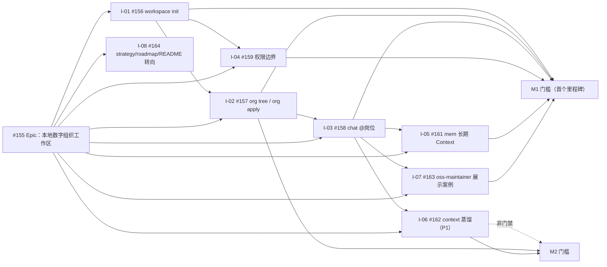

# Digital Employee 路线图

[English](roadmap.md)

本路线图把稳定的[产品策略](strategy.zh-CN.md)转化为可执行的 Issue 依赖图。
[Epic #155](https://github.com/fullstack-ai-infra/digital-employee/issues/155)
（本地数字组织工作区）是新主线的交付索引；[Epic #25](https://github.com/fullstack-ai-infra/digital-employee/issues/25)
仅保留为旧路线收尾索引。Issue label 和 milestone 是当前状态的事实来源；本文定义顺序、
归属和验收门槛，不承诺日期，也不复制完整 Issue 规格。

## 已交付基线

| 领域 | 当前源码中的证据 | 成熟度与剩余边界 |
| --- | --- | --- |
| 员工包开发 | 宿主中立的 `init`、理解员工包的 `validate`、有上限的 `doctor`、`minimal-answer.v1` 与 `structured-action.v1` recipe，以及可执行的离线契约 eval | 当前源码与公开 `0.4.0` 制品中已 **shipped**；fixture eval 不代表真实模型权益已验证 |
| 本机 Agent Host 执行 | 对 Qoder CLI、Claude Code、Qwen Code、CodeBuddy Code 提供版本锁定的 one-shot 路径 | **preview** 且 **fixture-conformant**；尚未证明真实模型权益 |
| Codex | 发现与 readiness 诊断 | **probe-only**；不是可运行 Adapter |
| Runner 内核 | 单任务的包摘要与密封快照、签名任务/租约校验、replay 端口、hash-chain 事件和签名回执 | 可嵌入的 **preview** 内核；未交付长期 Runner 或公开网络 SDK |
| 兼容运行时 | `standalone-v1` 答疑员工运行时与 connectors | 已 **shipped** 的兼容路径；不是新主线能力的目标路径 |
| deploy 命令 | 绑定员工包的 `deploy`，可验证的本地结果与 fail-closed 恢复 | **preview** 面；HTTP 可到 `ready`；钉钉对账外部 HOLD |

当前源码**没有** `workspace init`、`org tree` / `org apply`、`chat @岗位` 命令；
它们处于 **design** 状态，属于下面这条新主线。

## 交付依赖图（新主线）

规范交付顺序是：

- **M1（首个里程碑，已标记）：** [#156](https://github.com/fullstack-ai-infra/digital-employee/issues/156)
  → [#157](https://github.com/fullstack-ai-infra/digital-employee/issues/157)
  → [#158](https://github.com/fullstack-ai-infra/digital-employee/issues/158)，
  由 [#159](https://github.com/fullstack-ai-infra/digital-employee/issues/159)
  和 [#161](https://github.com/fullstack-ai-infra/digital-employee/issues/161)
  闭合权限与记忆回路，由 [#163](https://github.com/fullstack-ai-infra/digital-employee/issues/163)
  端到端验证 oss-maintainer 展示案例。
- [#162](https://github.com/fullstack-ai-infra/digital-employee/issues/162)
  （context 蒸馏）为 P1，不阻塞 M1。
- [#164](https://github.com/fullstack-ai-infra/digital-employee/issues/164)
  （本次转向）并行推进，不阻塞 M1。
- **M2：** context 蒸馏深度与 `org apply` 生命周期成为下一道门槛。渠道输出渲染
  （[#160](https://github.com/fullstack-ai-infra/digital-employee/issues/160)）
  由本次转向之外负责，不在此排期。

## M1 — 数字组织工作区（首个里程碑）

**用户结果：**用户把一个业务目录变成一支可直接点名、带长期 Context 与权限边界的 AI
团队，并端到端复现首个展示案例（oss-maintainer）。

| Story | 交付物 | 依赖 | 团队 |
| --- | --- | --- | --- |
| [#156](https://github.com/fullstack-ai-infra/digital-employee/issues/156) | `workspace init` 原型与 oss-maintainer 模板 | Epic #155 | 工作区 |
| [#157](https://github.com/fullstack-ai-infra/digital-employee/issues/157) | 组织模型与 `org tree` / `org apply` | #156 | 组织模型 |
| [#158](https://github.com/fullstack-ai-infra/digital-employee/issues/158) | `chat @岗位` 会话桥（turn contract 落地） | #102, #156 | 会话桥 |
| [#159](https://github.com/fullstack-ai-infra/digital-employee/issues/159) | 岗位权限边界（Context Scope + Authority Scope） | #156 | 治理 |
| [#161](https://github.com/fullstack-ai-infra/digital-employee/issues/161) | 长期 Context 集成（mem R1 级） | #158, mem #68 | 记忆 |
| [#163](https://github.com/fullstack-ai-infra/digital-employee/issues/163) | oss-maintainer 展示案例（quickstart 形态） | #156, #158 | 采用 |
| [#162](https://github.com/fullstack-ai-infra/digital-employee/issues/162) | context 事实蒸馏集成（规则版） | #158, context | Context（P1，非门禁） |

**门槛：** 干净机器 `workspace init` → `org tree` → `chat @岗位`（负责人与员工两条
路径）可走通；Context 切片很窄、权限边界成立；决策写入 `mem`，新会话可召回；`org apply`
保留 Context、重算权限；展示案例可按 quickstart 复现；所有声明遵守证据词汇。

**非目标：**渠道（只走 CLI）、marketplace/交易工作、全量 RBAC、Host 原生会话续接。

## M2 — Context 深度与组织生命周期

**用户结果：**工作区持续学习：会话原文被蒸馏为规则版实体图谱，`org apply` 成为组织
变化的可信方式。

| Story | 交付物 | 依赖 | 团队 |
| --- | --- | --- | --- |
| [#162](https://github.com/fullstack-ai-infra/digital-employee/issues/162) | 规则版 context 蒸馏驱动窄切片召回 | #158, context | Context |
| [#157](https://github.com/fullstack-ai-infra/digital-employee/issues/157) | `org apply` 审计组织变化 | #156 | 组织模型 |

**非目标：**渠道扩展（飞书/企微）、marketplace/交易工作、全量 RBAC。

## 旧路线收尾与 issue 处置

旧主线（**Builder → Seller Runner → Trusted execution**，Epic #25）正在收尾，不再扩展。
每个 open issue 都有明确的 **KEEP / REPURPOSE / PARK** 处置：KEEP 并入新主线；
REPURPOSE 重新落到工作区命令面；PARK 在旧路线收尾后冻结。处置是记录性的，不是破坏性
的：本路线图不批量改写、不关闭 issue；涉及代码的处置由后续工程 issue 执行。

### 新主线（Epic #155 及其子项）

| Issue | 标题 | 处置 |
| --- | --- | --- |
| [#155](https://github.com/fullstack-ai-infra/digital-employee/issues/155) | [Epic] 本地数字组织工作区：workspace / org / chat + 长期 Context | **KEEP** — 新主线交付索引；接替 #25 成为北星 |
| [#156](https://github.com/fullstack-ai-infra/digital-employee/issues/156) | feat(workspace): `workspace init` 原型 | **KEEP** — M1 |
| [#157](https://github.com/fullstack-ai-infra/digital-employee/issues/157) | feat(org): 组织模型与 `org tree` / `org apply` | **KEEP** — M1 |
| [#158](https://github.com/fullstack-ai-infra/digital-employee/issues/158) | feat(chat): `chat @岗位` 会话桥 | **KEEP** — M1 |
| [#159](https://github.com/fullstack-ai-infra/digital-employee/issues/159) | feat(org): 岗位权限边界 | **KEEP** — M1 |
| [#161](https://github.com/fullstack-ai-infra/digital-employee/issues/161) | feat(mem): 长期 Context 集成（R1 级） | **KEEP** — M1 |
| [#162](https://github.com/fullstack-ai-infra/digital-employee/issues/162) | feat(context): 事实蒸馏集成（规则版） | **KEEP** — M2（P1） |
| [#163](https://github.com/fullstack-ai-infra/digital-employee/issues/163) | showcase: oss-maintainer 案例（quickstart 形态） | **KEEP** — M1 |
| [#164](https://github.com/fullstack-ai-infra/digital-employee/issues/164) | docs(strategy): strategy/roadmap/README 主线转向 | **KEEP** — 本次转向；并行、不阻塞 |

> 不属于本次转向：[#160](https://github.com/fullstack-ai-infra/digital-employee/issues/160)
> （UX：渠道输出渲染）由 Epic #155 之外负责，这里有意不做改动。列出它只是为了不遗漏
> 任何一个 open issue；本路线图不为它指定处置或里程碑。

### 旧路线 issue（执行时 25 个 open）

| Issue | 标题 | 处置 |
| --- | --- | --- |
| [#25](https://github.com/fullstack-ai-infra/digital-employee/issues/25) | [Epic] 北星：Builder → Seller Runner → Trusted execution | **PARK** — 北星已被接替；仅保留为旧路线收尾索引，不再新增能力 |
| [#91](https://github.com/fullstack-ai-infra/digital-employee/issues/91) | [Epic] 采用：已验证 deploy 与干净机器 Quickstart | **REPURPOSE** — 采用 epic 重新落到新命令面：干净机器走查与展示案例采用（#163） |
| [#141](https://github.com/fullstack-ai-infra/digital-employee/issues/141) | docs(adoption): 收集干净机器安装笔记 | **REPURPOSE** — 安装笔记收集转移到 workspace/org/chat quickstart 路径 |
| [#142](https://github.com/fullstack-ai-infra/digital-employee/issues/142) | docs(adoption): 三个可复现展示案例 | **REPURPOSE** — 变成 oss-maintainer 展示案例（#163）加工作区命令面案例 |
| [#144](https://github.com/fullstack-ai-infra/digital-employee/issues/144) | feat(product): 场景管线、价值验收与路线图排序（#25） | **REPURPOSE** — 产品轨道保留；排序与价值验收从 #25 改指 Epic #155 |
| [#102](https://github.com/fullstack-ai-infra/digital-employee/issues/102) | RFC(runtime): 员工绑定 turn contract | **KEEP** — turn contract 是 `chat @岗位`（#158）的输入契约；Epic #155 依赖它 |
| [#104](https://github.com/fullstack-ai-infra/digital-employee/issues/104) | RFC(runtime): Digital 审计证据留存与恢复 | **KEEP** — 审计证据留存并入工作区回路（mem 出处） |
| [#19](https://github.com/fullstack-ai-infra/digital-employee/issues/19) | RFC: 外部控制面 adapter（包/Host/Runner 诊断） | **KEEP** — 本地控制面接缝；不阻塞 M1/M2 |
| [#90](https://github.com/fullstack-ai-infra/digital-employee/issues/90) | feat(cli): deploy 绑定精确员工包 | **PARK** — deploy 治理收尾；新主线不扩展 |
| [#70](https://github.com/fullstack-ai-infra/digital-employee/issues/70) | feat(cli): 如实本地 deploy 编排 | **PARK** — deploy 治理收尾；新主线不扩展 |
| [#86](https://github.com/fullstack-ai-infra/digital-employee/issues/86) | feat(cli): 确定性本地化 deploy 帮助 | **PARK** — deploy 治理收尾；新主线不扩展 |
| [#139](https://github.com/fullstack-ai-infra/digital-employee/issues/139) | feat(ux): deploy CLI 与外部安装路径体验 | **PARK** — deploy-CLI UX 不再扩展；外部安装路径摩擦已由 #141 与 #163 走查承担 |
| [#137](https://github.com/fullstack-ai-infra/digital-employee/issues/137) | chore(security): Runner/deploy 状态安全审计 | **PARK** — 旧路线安全审计按收尾完成，随后冻结 |
| [#113](https://github.com/fullstack-ai-infra/digital-employee/issues/113) | feat(host): 验收 Qoder structured_output | **PARK** — Host 资格验收收尾；旧路线不再新增 Host 能力 |
| [#125](https://github.com/fullstack-ai-infra/digital-employee/issues/125) | test(cli): claude-stream-agent-host 协议规范化 | **PARK** — 旧路线 Host 测试；按证据收尾，随后冻结 |
| [#52](https://github.com/fullstack-ai-infra/digital-employee/issues/52) | fix(host): 资格验收 deadline/清理/deny 证据如实化 | **PARK** — 旧路线 Host 资格证据；收尾后冻结 |
| [#46](https://github.com/fullstack-ai-infra/digital-employee/issues/46) | fix(host): 补全 agent-host.v1 语料与 validator 观察 | **PARK** — 旧路线 Host 资格证据；收尾后冻结 |
| [#55](https://github.com/fullstack-ai-infra/digital-employee/issues/55) | fix(host): 完成 real-local Phase A 加固 | **PARK** — 旧路线 Host 加固；收尾后冻结 |
| [#34](https://github.com/fullstack-ai-infra/digital-employee/issues/34) | research(host): 重新验收 Codex CLI | **PARK** — 旧路线研究观察项；除非新主线出现需求，否则冻结 |
| [#138](https://github.com/fullstack-ai-infra/digital-employee/issues/138) | chore(qualification): 提供实机与凭证做供应商验收 | **PARK** — 依赖已 PARK 的 #125/#77/#78；冻结 |
| [#136](https://github.com/fullstack-ai-infra/digital-employee/issues/136) | feat(release): 版本化发布证明通用下游选择 | **PARK** — 旧路线发布故事的最终门槛（#113）；按收尾完成，随后冻结 |
| [#77](https://github.com/fullstack-ai-infra/digital-employee/issues/77) | feat(channel): 飞书官方 bootstrap | **PARK** — 新主线首个里程碑不做渠道扩展 |
| [#78](https://github.com/fullstack-ai-infra/digital-employee/issues/78) | feat(channel): 企微企业应用边界 | **PARK** — 新主线首个里程碑不做渠道扩展 |
| [#97](https://github.com/fullstack-ai-infra/digital-employee/issues/97) | chore(governance): 消除单人 code-owner 审查瓶颈 | **KEEP** — 仓库治理在新主线上继续 |
| [#95](https://github.com/fullstack-ai-infra/digital-employee/issues/95) | chore(governance): 强制修订版 Issue 需求与验收账本 | **KEEP** — 仓库治理继续；本次转向本身就在消费它 |

## 阻塞与决策点

- #158（`chat @岗位`）等待 #102 turn contract 定稿；会话桥必须复用，不能再造第二个
  会话模型。
- #161 等待 #158 和 mem R1 级记忆平面（mem #68）；岗位 agent token 身份（mem #74）
  若未完成，首版可显式标注使用临时 token。
- #163 等待 #156 和 #158；展示案例是 M1 端到端验收产物。
- 旧路线收尾只按关闭性工作排序，绝不阻塞 M1 或 M2。

## 团队归属

| 团队 | 负责 Issue | 边界 |
| --- | --- | --- |
| 产品 | #155、#164、#144 | North Star、范围、依赖图、证据语言与路线图排序 |
| 工作区 | #156、#157、#159 | workspace init、组织模型、权限边界 |
| 会话与记忆 | #158、#161、#162 | 会话桥、长期 Context、context 蒸馏 |
| 采用 | #163、#91、#141、#142 | 展示案例、干净机器走查与采用内容 |
| 仓库治理 | #95、#97 | 需求/验收账本与审查瓶颈消除 |

## 私有工作（留在公司内）

marketplace 账户、上架、发现、评价、租赁、动态定价、Quote、Credit、计费、结算，以及
任何公司内交易都保持私有，并在本仓库之外跟踪。本开源仓库绝不实现它们。渠道扩展
（飞书/企微）不属于首个里程碑范围。

## 路线图维护规则

- 通过修改 Issue label 或 milestone 改变状态；依赖或门槛影响发生变化时，再同步本文快照。
- 实现证据记录在验证账本和关联 PR 中；不要把路线图变成重复的 Issue 正文。
- 跨模块里程碑工作使用 roadmap-item Issue Form。只给出产品名不构成 Agent 支持需求；
  必须写明用户结果、可强制能力边界、版本范围和可观察证据。
- 本文不增加日历承诺；交付顺序由门槛与依赖证据决定。
- 处置表必须与 open issue 保持同步；处置记录在本文，由拥有它的工程 issue 执行，
  绝不用于静默关闭 issue。
