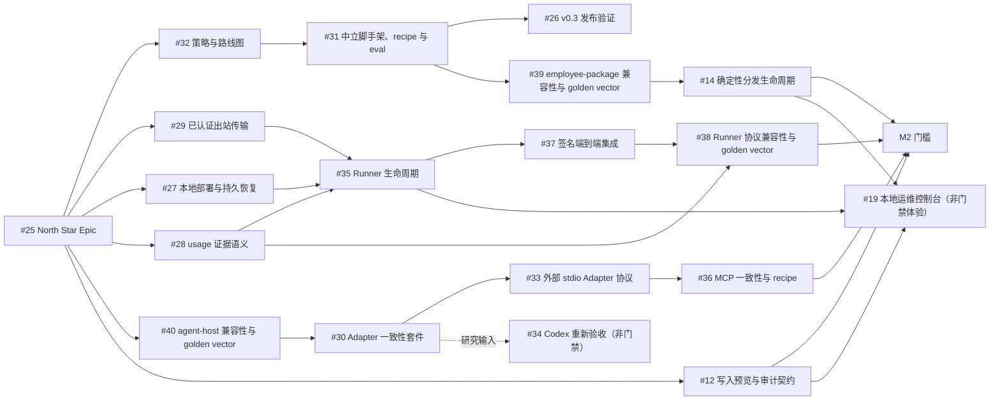

# Digital Employee 路线图

[English](roadmap.md)

本路线图把稳定的[产品策略](strategy.zh-CN.md)转化为可执行的 Issue 依赖图。
[Epic #25](https://github.com/fullstack-ai-infra/digital-employee/issues/25)是交付索引。
Issue label 和 milestone 是当前状态的事实来源；本文定义顺序、归属和验收门槛，不承诺
日期，也不复制完整 Issue 规格。

## 已交付基线

| 领域 | 当前源码中的证据 | 成熟度与剩余边界 |
| --- | --- | --- |
| Agent-native 开发 | 宿主中立的 `init`、理解员工包的 `validate`、有上限的 `doctor`、`minimal-answer.v1` 与 `structured-action.v1` recipe，以及可执行的离线契约 eval | 当前源码与 `0.3.0` root 制品中已 **shipped**；fixture eval 不代表真实模型权益已验证 |
| 本机 Agent Host 执行 | 对 Qoder CLI、Claude Code、Qwen Code、CodeBuddy Code 提供版本锁定的 one-shot 路径 | **preview** 且 **fixture-conformant**；尚未证明真实模型权益 |
| Codex | 发现与 readiness 诊断 | **probe-only**；不是可运行 Adapter |
| Runner 内核 | 单任务的包摘要与密封快照、签名任务/租约校验、replay 端口、hash-chain 事件和签名回执 | 可嵌入的 **preview** 内核；未交付长期 Runner 或公开网络 SDK |
| 兼容运行时 | `standalone-v1` 答疑员工运行时与 connectors | 已 **shipped** 的兼容路径；不是新通用 Agent 能力的目标路径 |

所有应用/服务员工都运行在发布者或运营者自己的电脑或服务器上。目标中的长期卖家
Runner 属于公开框架，但当前 one-shot 预览尚未交付它。

## 交付依赖图

规范交付顺序是：

- M0：[#32](https://github.com/fullstack-ai-infra/digital-employee/issues/32)
  → [#31](https://github.com/fullstack-ai-infra/digital-employee/issues/31)
  → [#26](https://github.com/fullstack-ai-infra/digital-employee/issues/26)。
- M1：[#29](https://github.com/fullstack-ai-infra/digital-employee/issues/29)
  + [#27](https://github.com/fullstack-ai-infra/digital-employee/issues/27)
  + [#28](https://github.com/fullstack-ai-infra/digital-employee/issues/28)
  → [#35](https://github.com/fullstack-ai-infra/digital-employee/issues/35)
  → [#37](https://github.com/fullstack-ai-infra/digital-employee/issues/37)。#35 的部分实现可以
  在输入契约设计期间并行推进，但门槛只能按这个顺序关闭。
- M2 员工包/分发链：
  #31 → [#39](https://github.com/fullstack-ai-infra/digital-employee/issues/39)
  → [#14](https://github.com/fullstack-ai-infra/digital-employee/issues/14)
  → M2 门槛。
- M2 Host/能力链：
  [#40](https://github.com/fullstack-ai-infra/digital-employee/issues/40)
  → [#30](https://github.com/fullstack-ai-infra/digital-employee/issues/30)
  → [#33](https://github.com/fullstack-ai-infra/digital-employee/issues/33)
  → [#36](https://github.com/fullstack-ai-infra/digital-employee/issues/36)
  → M2 门槛。
  [#34](https://github.com/fullstack-ai-infra/digital-employee/issues/34)是由 #30 提供研究输入的
  非门禁观察项，不是关闭 M2 的条件。
- M2 Runner 协议稳定链：
  [#28](https://github.com/fullstack-ai-infra/digital-employee/issues/28)
  + [#37](https://github.com/fullstack-ai-infra/digital-employee/issues/37)
  → [#38](https://github.com/fullstack-ai-infra/digital-employee/issues/38)
  → M2 门槛。
- M2 写入信任门槛：
  [#12](https://github.com/fullstack-ai-infra/digital-employee/issues/12)
  → M2 门槛。
- 非门禁体验支线：
  #12 + #14 + #35
  → [#19](https://github.com/fullstack-ai-infra/digital-employee/issues/19)。
  #19 消费稳定的公开契约，但不阻塞 M0、M1、M2 或 framework release。

## M0 — Builder Ready

**用户结果：**开发者可以安装 Agent-native 框架，创建不被强制套入 answer-agent 形态的
宿主中立员工，完成校验、评测和有文档支撑的本机执行。

| Story | 交付物 | 依赖 | 团队 |
| --- | --- | --- | --- |
| [#32](https://github.com/fullstack-ai-infra/digital-employee/issues/32) | 让策略与路线图成为仓库事实来源 | Epic #25 | 产品架构 |
| [#31](https://github.com/fullstack-ai-infra/digital-employee/issues/31) | 增加中立脚手架、入库 recipe 和可执行 eval | #32 | 开发者体验 |
| [#26](https://github.com/fullstack-ai-infra/digital-employee/issues/26) | 发布并独立校验 v0.3 制品 | #31 | 发布工程 |

**门槛：**干净机器 quickstart 可重复；至少两个明显不同的员工使用同一套契约；eval
真正执行；失败可定位并 fail closed；支持声明使用策略中的证据词汇；发布制品经过独立
验证。

**发布证据：**历史上的 core 包 dry-run 缺陷已不存在。发布工作流会分别实际打包 root
与 `./packages/core` 目标，独立校验每个归档的身份、内容和摘要，并执行干净消费者检查；
root 与独立 core 的 `0.3.0` 制品均已公开。Issue label 和 milestone 仍是当前状态的事实
来源；这些证据本身不宣称任何 Issue 已关闭。
当前 push 与 repair 发布会执行完整的干净安装消费者链路；历史制品的
asset-backfill 则有意使用对应 tag 自带的校验，并只做 import 兼容性验证。

## M1 — Seller Runner Ready

**用户结果：**卖家可以让员工持续运行在自己控制的机器上，在不开放入站端口、不上传
员工包、不泄露 Agent Host 凭证的前提下接收可信平台任务。

| Story | 交付物 | 依赖 | 团队 |
| --- | --- | --- | --- |
| [#29](https://github.com/fullstack-ai-infra/digital-employee/issues/29) | 已认证出站传输与设备密钥轮换契约 | Epic #25 | Runner 协议 |
| [#27](https://github.com/fullstack-ai-infra/digital-employee/issues/27) | 本地部署注册、持久 replay/outbox 与崩溃恢复 | Epic #25 | Runner 可靠性 |
| [#28](https://github.com/fullstack-ai-infra/digital-employee/issues/28) | 供应商中立的 usage 证据语义 | Epic #25 | 协议与信任 |
| [#35](https://github.com/fullstack-ai-infra/digital-employee/issues/35) | `runner init/doctor/start/status` 生命周期 | #29 + #27 + #28 | Runner 生命周期 |
| [#37](https://github.com/fullstack-ai-infra/digital-employee/issues/37) | 签名任务 → 本机 Runner → Host → 签名回执集成证据 | #35 | 集成与安全 |

**门槛：**公开 Runner 生命周期和本地绑定可安全跨重启、跨断网恢复；重放或过期 attempt
在启动前失败；入库的 mock 控制面测试覆盖从 claim 到 receipt；可观察证据证明本地路径、
员工包字节和 Host 凭证从未进入控制面。

## M2 — Framework v1 / Trust Ready

**用户结果：**开发者和集成方可以通过版本化、语言中立的兼容契约，独立校验并互操作
员工包、Agent Host 与 Runner 协议；分发和副作用操作同时保留显式验证与 fail-closed
信任边界。

| Story | 交付物 | 依赖 | 团队 |
| --- | --- | --- | --- |
| [#39](https://github.com/fullstack-ai-infra/digital-employee/issues/39) | 稳定 employee-package 兼容性与语言中立 golden vector | #31 | Builder 与分发 |
| [#14](https://github.com/fullstack-ai-infra/digital-employee/issues/14) | 确定性归档、校验/安装/回滚生命周期 | #39 | 分发 |
| [#40](https://github.com/fullstack-ai-infra/digital-employee/issues/40) | 稳定 agent-host 兼容性与语言中立 golden vector | 已交付 Agent Host 基线 | Host 资格验收 |
| [#30](https://github.com/fullstack-ai-infra/digital-employee/issues/30) | 可复用 Adapter 一致性与资格验收套件 | #40 | Host 资格验收 |
| [#33](https://github.com/fullstack-ai-infra/digital-employee/issues/33) | 外部 stdio Agent Host Adapter 协议与 SDK | #30 | Host 扩展性 |
| [#36](https://github.com/fullstack-ai-infra/digital-employee/issues/36) | MCP 一致性及合成记忆/文档 recipe | #33 | 能力生态 |
| [#38](https://github.com/fullstack-ai-infra/digital-employee/issues/38) | 稳定 Runner 协议兼容性与语言中立 golden vector | #28 + #37 | Runner 协议 |
| [#12](https://github.com/fullstack-ai-infra/digital-employee/issues/12) | 写入预览、审批、幂等与审计契约 | Epic #25 | 工具安全 |

**门槛：**employee-package、Agent Host 与 Runner 三层契约分别具备语言中立 golden
vector、版本协商、未知字段处理和确定性迁移规则；归档检查和回滚在不执行包代码的前提下
拒绝篡改；一个外部样例 Adapter 不修改核心分发逻辑即可通过一致性套件；usage 证据与
Quote/Credit 计算保持分离；写能力默认拒绝并满足 #12。

### 非门禁体验支线

| Story | 体验结果 | 前置条件 | 团队 |
| --- | --- | --- | --- |
| [#19](https://github.com/fullstack-ai-infra/digital-employee/issues/19) | 基于稳定公开框架 API 的可选本地运维控制台 | #12 + #14 + #35 | 本地运维体验 |

#19 属于 `Experience — Local Operator UX` milestone。它可以在输入契约稳定后推进，但缺少
该控制台不能阻塞 M0、M1、M2 或 framework release。

### 非门禁研究观察项

| Story | 研究问题 | 重新评估条件 | 团队 |
| --- | --- | --- | --- |
| [#34](https://github.com/fullstack-ai-infra/digital-employee/issues/34) | Codex 能否满足 default-deny 的可运行 Adapter 契约？ | #30 已可复用，且上游暴露可强制工具边界 | Host 资格验收 |

#34 可以扩展 Host 覆盖，但不是关闭 M2 的条件，也不得因此降低其他 Host 的资格门槛。

## 团队归属

| 团队 | 负责 Issue | 边界 |
| --- | --- | --- |
| 产品架构 | #25、#32 | North Star、范围、依赖图和证据语言 |
| Builder、分发与发布 | #31、#26、#39、#14 | 开发流程、recipe/eval、员工包兼容性、制品与分发生命周期 |
| Runner 与协议 | #29、#27、#28、#35、#37、#38 | 卖家机器客户端、持久性、公开传输、端到端证明与协议兼容性 |
| Host 资格验收 | #40、#30、#33、#34 | Agent Host 兼容性、Adapter 证据、外部协议与 Host 准入 |
| 能力与工具信任 | #36、#12 | MCP/recipe 一致性与安全副作用 |
| 本地运维体验 | #19 | Runner、写入信任和分发契约交付后，消费公开 API 的可选本地控制台 |

## 阻塞与决策点

- #26 历史上的 core 包 dry-run 缺陷已在发布工作流中解决；#26 当前状态仍以其 Issue
  label 和 milestone 为准。
- #29、#27、#28 未验收前，#35 不能关闭；并行代码不能豁免这些契约。随后由 #37
  证明组合链路。
- #39 等待 #31；随后 #14 消费稳定的员工包兼容契约。
- #40 必须先建立 Agent Host 兼容性，#30、#33、#36 才能按顺序关闭。
- #38 等待 #28 和 #37；其兼容性与 golden-vector 证据是必过的 M2 门槛。
- #12 是独立、必过的 M2 门槛。
- #19 作为非门禁体验消费者等待 #12、#14 和 #35；它不能推迟任何 milestone 或
  framework release。

## 私有控制面待办

以下工作明确属于 **private**，必须在本仓库之外跟踪：marketplace 账户、上架、发现、
评价和租赁；服务端设备注册与凭证签发；生产任务与租约调度；事件接收和独立
`UsageVerifier`；不可变 Quote 创建、Credit 账本、定价、计费、退款、打款、税务和结算；
marketplace UI 与运营后台。

本仓库只接纳公开 Runner 所需的可互操作客户端与协议契约。私有服务不得接收员工包
字节、本地路径或 Host 凭证，也绝不能执行员工。

## 路线图维护规则

- 通过修改 Issue label 或 milestone 改变状态；依赖或门槛影响发生变化时，再同步本文快照。
- 实现证据记录在验证账本和关联 PR 中；不要把路线图变成重复的 Issue 正文。
- 跨模块里程碑工作使用 roadmap-item Issue Form。只给出产品名不构成 Agent 支持需求；
  必须写明用户结果、可强制能力边界、版本范围和可观察证据。
- 本文不增加日历承诺；交付顺序由门槛与依赖证据决定。
