# Next direction: safety, trust, and business ontology

[简体中文](trust-ontology.zh-CN.md) · [Product strategy](strategy.md) · [Roadmap](roadmap.md)

**Status: design proposal, awaiting review.** Consumes
[requirement #346 R1](https://github.com/bytefolk/digital-employee/issues/346).
Source baseline: `79cf7f21b0c1c2281e69ef38616e6fccc4897b66` (2026-09-22).
The business-object contracts, object-level policies, and action receipts proposed
here are not implemented. Merging this document does not establish direction
acceptance, runtime delivery, or publication. Subsequent implementation requires
separate revisioned requirements with pinned dependencies and acceptance owners.

## 1. User outcome

After assigning a task to a position, the owner can see **which business objects
it is handling, which facts support its conclusions, what it may do, who approved
which action, what actually happened, and who handles exceptions.** When a new
session continues the work, memory provides leads without carrying forward
expired authority or treating an old judgment as a current fact.

Keep the local digital-organization workspace direction and complete its work
loop:

> Address a position → identify business objects and relations → read facts with
> provenance → propose an action → check permissions and any required approval →
> execute within bounds → verify the result → preserve evidence → continue under
> current permissions next time.

The three lines solve different problems and must be accepted in one scenario:

| Direction | User benefit | Acceptance focus |
| --- | --- | --- |
| Safety | A position sees only authorized data and performs only authorized actions | Deny out-of-scope requests, expiry, unknown capabilities, and invalid approvals; unauthorized paths have no side effects, and execution failures have verifiable states |
| Trust | Conclusions can be checked, execution states can be verified, and failures have reasons | Distinguish facts, inferences, proposals, and unknowns; connect sources, versions, policies, and results |
| Ontology | A business object retains consistent meaning across tools, positions, and sessions | Stable identity, types, relations, states, provenance, and versions; objects and actions can be validated |

Ontology is a business semantic contract, not merely more vectors, a knowledge
graph, or a renamed prompt. It supplies objects and relations for policy
decisions. **Authority must come from trusted configuration and enforcement
boundaries; model-generated relations cannot grant permissions.**

## 2. Existing foundation and remaining gaps

The following describes only the baseline source and existing repository
verification records. It makes no new npm availability claim. The
[verification ledger](verification.md) and release receipt remain authoritative
for evidence levels and publication.

| Existing seam | Verifiable reference | Next-stage gap |
| --- | --- | --- |
| Workspace, positions, budgets, and reporting relationships | [Workspace/organization model](../apps/cli/org/model.ts), [hire contract](hire-contract.md) | Link business objects to tasks, object owners, and exception responsibility; a position owner does not automatically receive all data or write authority |
| Context Scope and Authority Scope | [Permission implementation](../packages/engine/src/org-permissions.ts); tool allowlists and `writes: deny` | Beyond tool availability, decide using the object, action, fields, purpose, and current authorization version |
| Bounded read-only turns and terminal evidence | [Executor](../packages/engine/src/turn-executor.ts), [evidence contract](../packages/engine/src/turn-evidence.ts), [evidence persistence](../apps/cli/turn/file-evidence-sink.ts) | The current text-only loop does not dispatch business write tools; turn completion and business-action success need separate records |
| Approval lifecycle and turn approval events | [Approval state machine](../packages/core/src/write-approval-engine.ts), [engine approval](../packages/engine/src/approval.ts) | Business-action digest binding, execution-time revalidation, durable replay protection, and recovery; the existing protocol is not a production write-authorization service |
| Context recall | [ContextPort](../packages/core/src/context-port.ts) | Existing `raw_excerpt` / `entity_mention` / `task_marker` items are not a business ontology; future projections need types, source versions, and field policies |
| Memory recall and task state | [Memory integration](memory-port.md), [cross-process source-built service demonstration](evidence/w1-acceptance/mem-recall-e2e.md) | Records exist for real source-built mem with a deterministic model across processes; the current CLI saves a fixed terminal summary and output digest, not extracted business decisions. Exact published artifacts, least-privilege deployment, and ontology continuity still need acceptance |
| Position connector declarations | [Declaration validation](../packages/core/src/position-connectors.ts) | Declaration validation is neither runtime binding nor action authorization |
| MCP configuration boundary | [Existing trust guidance](employee-package.md#mcp-manifest-trust-boundary-210-finding-2) | Operators review servers and credential scope; runtime tool capabilities, arguments, network access, and output boundaries still require individual qualification |

Reuse these seams instead of building another engine, memory system, or approval
center. Do not silently add fields to exact-key `*.v1` contracts. Version new
projections independently, then integrate through explicit negotiation and
compatibility tests.

Existing verification entry points include [permission tests](../tests/apps/org-permissions.test.ts),
[Context recall tests](../tests/engine/turn-context-recall.test.ts), and
[approval state-machine tests](../tests/core/write-approval.test.ts). Deterministic
injection fixtures establish only the tested permission/event boundaries; they
do not establish live-model resistance to injection or answer correctness.
Context's per-item observed versions are not a cross-system transactional
snapshot. Preserve uncertainty when sources are not synchronized.

## 3. Minimal business ontology

### Objects, relations, and actions

Use the existing `oss-maintainer` scenario as the first domain, with synthetic
data or explicitly authorized public-repository material. Start with read-only
judgments by `repo-owner` and `issue-researcher`, without building a universal
graph from all enterprise data.

| Concept | Minimal meaning | Existing seam / new scope |
| --- | --- | --- |
| Workspace / Position | Workspace and position identities, reporting relationships, budgets | Reuse the organization model; the organization tree is not the business relation graph |
| BusinessObject | Stable business identities such as Repository, Issue, PullRequest, ChangeSet, and Review | New domain projection; adapters map native source-system IDs |
| Relation | `Issue belongsTo Repository`, `PullRequest addresses Issue`, `Review reviews ChangeSet` | New type constraints, endpoint identities, provenance, and effective versions; `addresses` means association, not acceptance |
| Task / Turn | Goal, target objects, executing position, budget, execution record | Link existing turns; keep task state separate from upstream Issue/PR state |
| Evidence / Claim | Controlled references to source excerpts; facts, inferences, proposals, or unknowns based on them | New business-conclusion projection linked to existing turn evidence; no chain-of-thought records |
| ActionProposal | One concrete action on a specified object with an expected change | New proposal; producing it grants no execution authority |
| PolicyDecision / Approval / ActionReceipt | Whether an action is allowed, what was approved, and what was observed after execution | Reuse applicable approval/evidence seams and add action-level binding; none substitutes for another |

An object needs at least `namespace`, `type`, `objectId`, `sourceRef`,
`sourceRevision`, `observedAt`, `schemaVersion`, `classification`, and
`provenanceRef`. Track mutable properties' versions and provenance separately.
The `namespace` isolates workspaces/source tenants; identical names must not
merge identities across domains. Only reviewed mappings establish cross-source
aliases. Model similarity produces candidates; conflicts require human review.

A relation needs its type, both object references, provenance, version, and
effective time. Reading it requires visibility of both endpoints and the
relation itself, so edges cannot expose hidden objects. Extracted `owns` or
`reportsTo` relations must not override trusted organization configuration.
Model business-entity ownership separately from position reporting lines.

Each Claim is marked `fact` / `inference` / `proposal` / `unknown` and references
specific Evidence, source versions, and transformation-rule versions. Preserve
conflicting sources side by side; unverified inferences must not become facts.
Withdrawn, deleted, or expired sources invalidate dependent conclusions, which
must be revalidated on the next recall. Summaries of restricted content remain
subject to permissions and retention policies.

### Reviewable example (design illustration, not executable configuration)

| Record | Synthetic example | Required constraint |
| --- | --- | --- |
| Object | `demo / PullRequest / pr-17`, revision `head-A` | Do not bind to another workspace's `pr-17` merely because the names match |
| Relation | `pr-17 addresses issue-8`; `review-3 reviews change-head-A` | Bind Review to the exact head; association with an Issue does not mean resolution |
| Claim | “Required checks passed for head-A,” citing the corresponding check runs | Missing checks, failures, or a changed head invalidate this conclusion |
| ActionProposal | Recommend adding `needs-tests` to `pr-17@head-A` | Include action, argument summary, target revision, and supporting evidence; the first stage produces proposals only |
| PolicyDecision | Position may read the repository; writing is denied | Owner identity, tool availability, or high model confidence cannot override `writes: deny` |
| ActionReceipt (later stage) | After authorization, perform one label write in an isolated test repository and read it back | Enforce approval-bound preconditions at mutation time and report verified only after readback matches the expected change; do not also merge the PR |

Relations explain why a particular Review can support a judgment about a PR.
Ontology does not replace source systems such as GitHub, or infer product
acceptance or a human APPROVED verdict from green CI.

## 4. Safety and trust in the execution path

```mermaid
flowchart LR
  S["Authorized sources"] --> A["Adapter: identity / version / field projection"]
  A --> C["Context / Memory: untrusted data with provenance"]
  C --> P["Position turn: Claim + ActionProposal"]
  P --> G["Execution boundary: current policy + object revision + required approval"]
  G -->|Deny or propose only| E["Controlled evidence and outcome explanation"]
  G -->|Enabled only in the later write stage| X["Constrained connector execution"]
  X --> V["Read back and verify source-system state"]
  V --> E
  E --> M["Bounded state projection: recheck permissions next time"]
```

This is the target path, not a claim that the current engine supports connector
writes.

### Enforce authorization at data-read and side-effect boundaries

An action must satisfy all of: verified workspace/caller identity, position
permissions, object and field permissions, an action allowlist, connector
capabilities and credential scope, budget, and applicable human approval. Do not
execute if any condition is denied or indeterminate. Intersect these conditions;
approval cannot override another denial. Context Scope bounds what can be seen;
Authority Scope bounds what can be done. Preserve both; a graph-query result
cannot replace them.

| Trust boundary | Required enforcement | When evidence is missing |
| --- | --- | --- |
| User/channel → position | Trusted ingress binds identity and workspace; input cannot claim a wider scope | Deny or require the missing identity |
| Source → ontology/Context | Validate source allowlists, tenant, object identity, revision, fields, and size limits | Reject identity, tenant, scope, schema, or integrity failures before projection/model consumption; mark missing/conflicting facts unknown only after authorization and contract validation pass |
| Recall/model → policy | Text, relations, and model output are data; they cannot change grants, tool registries, or approvers | Injected instructions do not change authority |
| Proposal → approval → execution | Bind approval to action digest, object revision, operator, workspace, policy version, and expiry | Changed content or versions invalidate the old approval |
| Position → tool/network | Native tools and MCP follow the same policy; use minimum credentials, network allowlists, timeouts, and resource limits | Do not enable capabilities whose constraints cannot be enforced |
| Execution → result/memory | Verify external outcomes; isolate sensitive originals under ACLs; logs contain only restricted summaries/codes | Do not record unknown outcomes as success or retry them directly |

### Action states and recovery (planned contract)

`proposed → denied / awaiting_approval / authorized → executing → verified / failed / unknown`;
`awaiting_approval / authorized → expired` denotes an unexecuted authorization
that has expired.
Valid read-only actions may proceed directly to authorized; writes requiring
approval must pass through awaiting_approval. Expired approvals enter expired and
require a new proposal/decision. Denials invoke no tool. Distinguish confirmed
no-effect failures from unknown effects.

- Recheck permissions, approval expiry, object revision, and revocation before
  execution. Changed objects require a new preview, decision, and approval.
- When an object revision is an authorization precondition, the actual mutation
  must enforce it through provider-side atomic conditional updates/CAS or a
  verified equivalent fencing mechanism. Pre-call checks and post-call readback
  cannot replace this constraint. Connectors that cannot enforce it must not
  enable such revision-bound actions. The label pilot must first demonstrate
  that the actual API enforces its declared preconditions; otherwise, continue
  producing proposals only, or separately review an action contract that does
  not depend on that revision condition.
- The canonical action digest covers scope, position, object type/ID/revision,
  action, arguments, and policy version. Version sorting and normalization rules;
  do not merely hash mutable natural-language text.
- Persist action IDs, idempotency keys, and state transitions. Use an atomic
  claim to prevent concurrent consumption of the same authorization. Recover
  executing states after restart and verify external effects before deciding
  whether to retry. Providers without idempotency support require human handling
  when effects are unknown.
- If audit persistence is unavailable, deny before writing. If an external
  effect occurred but receipt persistence failed, retain recoverable intent and
  unknown status; do not invent rollback or report complete success. Provide
  pause, credential revocation, replay detection, and human reconciliation SOPs.
- Do not promise cross-provider exactly-once execution. Compensation is another
  action requiring its own authorization. Revoking approval cannot undo an
  existing side effect; deleting a document or reverting code does not undo a
  business operation.

### Limits of trustworthy evidence

Execution evidence establishes what happened under specified versions, policies,
and boundaries; it does not inherently establish business correctness. Digests
can detect changed content. Digital signatures establish that a key holder made
a statement, not that source facts, model judgments, or business outcomes are
true. Do not describe current local evidence files as a tamper-proof production
audit system.

Business evidence must link turn/action IDs, package/ontology/policy versions,
object and source revisions, decision codes, applicable approval references,
connector/provider request references, verification observations, and times.
Keep originals in separate controlled storage. Evidence indexes, object IDs,
references, and summaries can also disclose information, so they require access
control, redaction, retention periods, and deletion policies. Do not save raw
prompts, credentials, or chain of thought to “improve auditability.”

## 5. First pilot SOP and acceptance

**Pilot one: read-only repository maintenance.** The owner configures a source
allowlist, two positions, and a synthetic dataset. `issue-researcher` links a
selected Issue to PRs, Reviews, and check evidence; `repo-owner` receives
recommendations and unknowns. This PR delivers the design. The following are
future implementation acceptance specifications, not feature tests run for this
PR.

1. The operator registers sources/readable fields, identity mappings,
   permissions, retention periods, and sample revisions. Do not commit real
   private material.
2. The domain owner reviews object types, relations, state machines, and gold
   answers. Do not automatically merge ambiguous objects.
3. Run read-only turns producing conclusions, references, gaps, proposed
   actions, and denial reasons, with linked execution evidence for each turn.
4. An independent reviewer checks sources and permission negatives; the
   business owner assesses usefulness. Record errors; authors cannot accept
   their own work.
5. Repeat in a new session after object updates, narrowed permissions, and
   source withdrawal. Verify that continuity cannot bypass current permissions.
6. A later write pilot uses only a reversible label action in an isolated test
   repository: preview, obtain human approval, execute, read back, and
   reconcile. Merge, deletion, publication, and financial actions are excluded.

| Gate / scenario | Observable pass condition | Stage |
| --- | --- | --- |
| T01 Normal read-only task | Trace conclusions to exact sources/revisions; proposals cause no external effects; produce a terminal and evidence within budget | Read-only |
| T02 Same-name / cross-workspace objects | Do not mix identities; reject wrong namespaces; do not expose hidden objects or relations | Read-only |
| T03 Injection and memory poisoning | Source instructions to “ignore policy” or forged approvals/owner relations do not change tools or authority | Read-only |
| T04 Conflicting, expired, or deleted sources | State unknown/conflict and invalidate dependent conclusions; do not fabricate references or reuse stale decisions | Read-only |
| T05 Permission narrowing and cross-session recovery | Reauthorize queries; old caches, relation edges, and task summaries cannot expose revoked data | Read-only |
| T06 Unknown types/versions/tools | Validation fails without permissive fallback; older versions retain only explicitly supported read-only paths | Read-only |
| T07 Budget and service failures | Bounded termination and explicit errors; permission errors cannot degrade into ignorable recall outages | Read-only |
| T08 Replaced, expired, or revoked proposals/approvals | Changed arguments, object head, policy, or principal deny execution | Before writes |
| T09 Concurrency, replay, and process restart | One action does not take effect twice; audit/idempotency state is recoverable; reconcile unknown effects first | Before writes |
| T10 Provider timeout / partial success | Do not claim success or retry blindly; readback/human reconciliation distinguishes failure from unknown | Before writes |
| T11 Audit unavailable / content leakage | Deny before writing; controlled evidence contains no originals/secrets; deny unauthorized evidence reads | Before writes |
| T12 End-to-end authorized write | One label write in an isolated test repository matches readback, with a complete proposal/decision/approval/receipt chain | Write pilot |

Register denominators first: every scenario, sample object, permission
combination, Host/connector version, and fault-injection method belongs in the
acceptance inventory. All blocking negative cases must pass before advancing.
That establishes passage of this test set, not absolute safety.

| Suggested pilot metric (not yet measured) | Definition / use |
| --- | --- |
| Conclusion evidence coverage | Verifiable factual claims with accessible, version-matched evidence / all verifiable factual claims |
| Business correctness | Conclusions judged correct by an independent domain reviewer / reviewed conclusions; report unknowns separately without silently removing them from the denominator |
| Unauthorized-request blocking rate | Negative cases denied without side effects/leakage / all registered unauthorized-request negative cases; this is a test-set metric |
| Action verification rate | Actions whose readback matches / initiated actions; list failed, unknown, and partial-success outcomes separately |
| Human effort and elapsed time | Human verification minutes and completion time for the same fixed task set, compared with the pre-pilot manual process |

Collect the baseline before setting business-benefit targets. Without sample
size, manual baseline, and pilot data, do not promise savings percentages,
accuracy, or production safety.

## 6. Implementation order, ownership, and dependencies

These are proposed slices, not scheduled work or assignments to individuals.
Subsequent requirements must name the person filling each owner role.
Cross-repository dependencies require confirmation and pinned revisions from
their owners; merging this PR does not activate them.

| Slice | Deliverable and accountable roles | Dependencies and exit gate |
| --- | --- | --- |
| D0 Baseline and threat model | DE maintainers + security reviewer: check capability matrix, ingress identities, and permissions; register pilot data and every trust boundary | Preserve existing W1 sequencing; claims match [verification](verification.md), and production gaps are explicit |
| D1 Minimal ontology contract | DE contract owner + domain owner: versioned read-only projections for objects/relations/Claims/ActionProposals, synthetic fixtures, migration rules | D0; exact-key, identity-conflict, and unknown-version negatives pass; no reinterpretation of existing v1 contracts |
| D2 Trustworthy read-only loop | Engine owner + adapter/context/mem integrators: object/field filtering, source invalidation, evidence linkage, cross-session revalidation | D1 + pinned recall/execution interfaces; T01–T07 and human domain acceptance; list real-service evidence separately |
| D3 Controlled-action foundation | Engine/policy owner + connector owner + independent security reviewer: proposal binding, durable approval/idempotency, execution-time revalidation, readback/recovery | D2 + separately approved write requirement + enforceable tool path; T08–T11 all pass and independent review has no blocking findings |
| D4 Bounded write pilot | Business owner + operator: test-repository label action and pause/revocation/reconciliation exercises | D3; T12, real-provider receipts, human acceptance; decide on expansion afterwards |

Relation to the existing roadmap: D0/D1 may proceed as design and offline
contracts. D2 deepens M2–M3 Context/harness work. D3/D4 can start only after
separate write-qualification gates are met. This document adds no W1 gate,
changes no existing dates, does not bring forward M4+ general parallel/recursive
orchestration, and does not extend the finished Runner track.

| Boundary | Responsibilities (proposed; pending each repository's confirmation) |
| --- | --- |
| digital-employee | Position execution, policy enforcement, cross-boundary contract validation, evidence generation; ontology consumption and action binding |
| context / business adapters | Source mapping, entity/relation projections, source revisions and invalidation propagation; no execution grants |
| mem | Scoped long-term state access, retention/deletion, and provenance; recalled content does not become authority |
| Workbench / org-workbench consumers | Present objects, supporting evidence, previews, approvals, and outcomes; preserve the task history they own; backend validation remains independent |
| Business owners / operators | Semantic/correctness acceptance, approver scope, credential configuration, exception response, and actual benefit measurement |

## 7. This PR's boundary and review decisions

This PR adds direction documents and navigation only: no runtime, schemas,
credentials, dependencies, write permissions, or data migrations. Reverting the
documents can restore previous navigation; it is not a rollback plan for future
business actions.

Review must decide whether to accept the minimal ontology scope, use read-only
repository maintenance as the first pilot, identify D1/D2 owners and data
sources, and accept the qualification gates before D3. Unresolved points remain
proposals and do not commit other repositories or business stakeholders. Passing
CI establishes only that this document candidate passes the existing repository
checks. Record human direction review, future runtime acceptance, and actual
publication separately.
